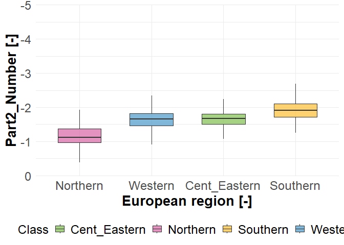
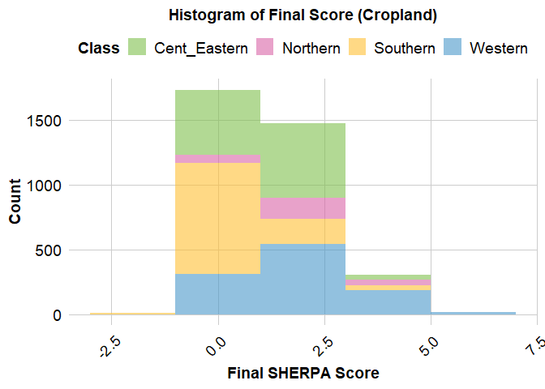

Assessing soil health quantitatively at European scale considering soil
genesis
================
Christine Alewell, Surya Gupta, Jerome Poulenard, Noémie Niquille,
Antonia Kaiser,Nima Shokri, Simon Scheper, Miriam Gross-Schmölders,
David Robinson, GrantCampbell, Cezary Kabala, Friederike Lang, Nancy
Dise, Panos Panagos, Pasquale Borrelli

- [Grassland (Part1)](#grassland-part1)
- [Cropland (Part1)](#cropland-part1)

We introduce SHERPA (Soil Health Evaluation, Rating Protocol, and
Assessment) as a framework and present a first assessment across Europe.

LUCAS data [link](https://esdac.jrc.ec.europa.eu/projects/lucas)

``` r
##Load the libraries

library(readxl)
library(tidyr)
library(plyr)
library(rgdal)
```

    ## Loading required package: sp

    ## The legacy packages maptools, rgdal, and rgeos, underpinning the sp package,
    ## which was just loaded, will retire in October 2023.
    ## Please refer to R-spatial evolution reports for details, especially
    ## https://r-spatial.org/r/2023/05/15/evolution4.html.
    ## It may be desirable to make the sf package available;
    ## package maintainers should consider adding sf to Suggests:.
    ## The sp package is now running under evolution status 2
    ##      (status 2 uses the sf package in place of rgdal)

    ## Please note that rgdal will be retired during October 2023,
    ## plan transition to sf/stars/terra functions using GDAL and PROJ
    ## at your earliest convenience.
    ## See https://r-spatial.org/r/2023/05/15/evolution4.html and https://github.com/r-spatial/evolution
    ## rgdal: version: 1.6-7, (SVN revision 1203)
    ## Geospatial Data Abstraction Library extensions to R successfully loaded
    ## Loaded GDAL runtime: GDAL 3.6.2, released 2023/01/02
    ## Path to GDAL shared files: C:/Users/surya/AppData/Local/R/win-library/4.3/rgdal/gdal
    ##  GDAL does not use iconv for recoding strings.
    ## GDAL binary built with GEOS: TRUE 
    ## Loaded PROJ runtime: Rel. 9.2.0, March 1st, 2023, [PJ_VERSION: 920]
    ## Path to PROJ shared files: C:/Users/surya/AppData/Local/R/win-library/4.3/rgdal/proj
    ## PROJ CDN enabled: FALSE
    ## Linking to sp version:2.0-0
    ## To mute warnings of possible GDAL/OSR exportToProj4() degradation,
    ## use options("rgdal_show_exportToProj4_warnings"="none") before loading sp or rgdal.

``` r
library(dplyr)
```

    ## 
    ## Attaching package: 'dplyr'

    ## The following objects are masked from 'package:plyr':
    ## 
    ##     arrange, count, desc, failwith, id, mutate, rename, summarise,
    ##     summarize

    ## The following objects are masked from 'package:stats':
    ## 
    ##     filter, lag

    ## The following objects are masked from 'package:base':
    ## 
    ##     intersect, setdiff, setequal, union

``` r
library(raster)
```

    ## 
    ## Attaching package: 'raster'

    ## The following object is masked from 'package:dplyr':
    ## 
    ##     select

``` r
library(ranger)
library(terra)
```

    ## terra 1.7.39

    ## 
    ## Attaching package: 'terra'

    ## The following object is masked from 'package:rgdal':
    ## 
    ##     project

    ## The following object is masked from 'package:tidyr':
    ## 
    ##     extract

``` r
library(Metrics)
library(hexbin)
library(lattice)
library(RColorBrewer)
library(viridis)
```

    ## Loading required package: viridisLite

``` r
library(ggplot2)
library(foreign)

LUCAS_final<- read.csv("C:/Users/surya/Downloads/SHERPA_dataset/Datasets_Sherpa_11_feb/Lucas_data.csv")

colnames(LUCAS_final)
```

    ##  [1] "X"                                         
    ##  [2] "POINTID"                                   
    ##  [3] "OID_"                                      
    ##  [4] "Field1"                                    
    ##  [5] "Depth"                                     
    ##  [6] "pH_CaCl2"                                  
    ##  [7] "pH_H2O"                                    
    ##  [8] "EC"                                        
    ##  [9] "OC"                                        
    ## [10] "CaCO3"                                     
    ## [11] "P"                                         
    ## [12] "N"                                         
    ## [13] "K"                                         
    ## [14] "OC__20_30_cm_"                             
    ## [15] "CaCO3__20_30_cm_"                          
    ## [16] "Ox_Al"                                     
    ## [17] "Ox_Fe"                                     
    ## [18] "NUTS_0"                                    
    ## [19] "NUTS_1"                                    
    ## [20] "NUTS_2"                                    
    ## [21] "NUTS_3"                                    
    ## [22] "TH_LAT"                                    
    ## [23] "TH_LONG"                                   
    ## [24] "SURVEY_DATE"                               
    ## [25] "Elev"                                      
    ## [26] "LC"                                        
    ## [27] "LU"                                        
    ## [28] "LC0_Desc"                                  
    ## [29] "LC1_Desc"                                  
    ## [30] "LU1_Desc"                                  
    ## [31] "Landslide"                                 
    ## [32] "Zinc"                                      
    ## [33] "Antimony"                                  
    ## [34] "Soil_erosion"                              
    ## [35] "Lead"                                      
    ## [36] "Nickel"                                    
    ## [37] "Manganese"                                 
    ## [38] "Mercury"                                   
    ## [39] "Cobalt"                                    
    ## [40] "Chromium"                                  
    ## [41] "Copper"                                    
    ## [42] "Cadmium"                                   
    ## [43] "Arsenic"                                   
    ## [44] "dep_nhx_2015"                              
    ## [45] "dep_nhx_2016"                              
    ## [46] "dep_nhx_2017"                              
    ## [47] "dep_nhx_2018"                              
    ## [48] "dep_nhx_2019"                              
    ## [49] "dep_noy_2015"                              
    ## [50] "dep_noy_2016"                              
    ## [51] "dep_noy_2017"                              
    ## [52] "dep_noy_2018"                              
    ## [53] "dep_noy_2019"                              
    ## [54] "nfer_crop_nh4_2015"                        
    ## [55] "nfer_crop_nh4_2016"                        
    ## [56] "nfer_crop_nh4_2017"                        
    ## [57] "nfer_crop_nh4_2018"                        
    ## [58] "nfer_crop_nh4_2019"                        
    ## [59] "nfer_crop_no3_2015_Kg_N_ha"                
    ## [60] "nfer_crop_no3_2016_Kg_N_ha"                
    ## [61] "nfer_crop_no3_2017_Kg_N_ha"                
    ## [62] "nfer_crop_no3_2018_Kg_N_ha"                
    ## [63] "nfer_crop_no3_2019_Kg_N_ha"                
    ## [64] "nfer_pas_nh4_2015_Kg_N_ha"                 
    ## [65] "nfer_pas_nh4_2016_Kg_N_ha"                 
    ## [66] "nfer_pas_nh4_2017_Kg_N_ha"                 
    ## [67] "nfer_pas_nh4_2018_Kg_N_ha"                 
    ## [68] "nfer_pas_nh4_2019_Kg_N_ha"                 
    ## [69] "nfer_pas_no3_2015_Kg_N_ha"                 
    ## [70] "nfer_pas_no3_2016_Kg_N_ha"                 
    ## [71] "nfer_pas_no3_2017_Kg_N_ha"                 
    ## [72] "nfer_pas_no3_2018_Kg_N_ha"                 
    ## [73] "nfer_pas_no3_2019_Kg_N_ha"                 
    ## [74] "nmanure_app_crop_2015_Kg_N_ha"             
    ## [75] "nmanure_app_crop_2016_Kg_N_ha"             
    ## [76] "nmanure_app_crop_2017_Kg_N_ha"             
    ## [77] "nmanure_app_crop_2018_Kg_N_ha"             
    ## [78] "nmanure_app_crop_2019_Kg_N_ha"             
    ## [79] "nmanure_app_pas_2015_Kg_N_ha"              
    ## [80] "nmanure_app_pas_2016_Kg_N_ha"              
    ## [81] "nmanure_app_pas_2017_Kg_N_ha"              
    ## [82] "nmanure_app_pas_2018_Kg_N_ha"              
    ## [83] "nmanure_app_pas_2019_Kg_N_ha"              
    ## [84] "nmanure_dep_pas_2015_Kg_N_ha"              
    ## [85] "nmanure_dep_pas_2016_Kg_N_ha"              
    ## [86] "nmanure_dep_pas_2017_Kg_N_ha"              
    ## [87] "nmanure_dep_pas_2018_Kg_N_ha"              
    ## [88] "nmanure_dep_pas_2019_Kg_N_ha"              
    ## [89] "Miniral_P_input"                           
    ## [90] "Organic_P_input"                           
    ## [91] "P_export_grain"                            
    ## [92] "P_export_residue"                          
    ## [93] "Multiple_concurrent_soil_erosion_processes"
    ## [94] "Wind"                                      
    ## [95] "Nitrogen_Surplus"

``` r
##This dataset contains all the LUCAS data and the values from different input data from the maps. 

table(LUCAS_final$LC0_Desc)
```

    ## 
    ## Artificial land        Bareland        Cropland       Grassland       Shrubland 
    ##              71             638            7430            3988             720 
    ##           Water        Wetlands        Woodland 
    ##               5              40            6092

``` r
cropland<- LUCAS_final[LUCAS_final$LC0_Desc=="Cropland",]

Grassland<- LUCAS_final[LUCAS_final$LC0_Desc=="Grassland",]

Forestland<- LUCAS_final[LUCAS_final$LC0_Desc=="Woodland",]
```

## Grassland (Part1)

``` r
Grassland2<- Grassland[,c(1:52, 78:95)]

Grassland2$Net_phophorus<- (Grassland2$Miniral_P_input+Grassland2$Organic_P_input)
 
Grassland2$EC<- Grassland2$EC/100

Grassland4<- Grassland2[!is.na(Grassland2$Net_phophorus),]
 
## the new file is loaded because the current dataset was missing the carbon stock, Bulk density, land slide density,
## Risk score, Active ingredient, and soil texture class 

##read grassland_data
Grassland5<- read.dbf("C:/Users/surya/Downloads/SHERPA_dataset/Datasets_Sherpa_11_feb/Grassland_data.dbf")

Grassland5<- Grassland5[,c(2,72:77)]

Grassland4<- merge(Grassland4, Grassland5, by = "POINTID")

############Soil texture

Grassland4 <- Grassland4 %>% 
  mutate(Soil_tex_class = case_when(
    textureUSD == -9999 ~ NA_character_,  # Change to NA_character_
    textureUSD == 1 ~ "Clay", 
    textureUSD == 2 ~ "Silty Clay",
    textureUSD == 3 ~ "Silty Clay Loam",
    textureUSD == 4 ~ "Sandy Clay",
    textureUSD == 5 ~ "Sandy Clay Loam",
    textureUSD == 6 ~ "Clay Loam",
    textureUSD == 7 ~ "Silt",
    textureUSD == 8 ~ "Silt Loam",
    textureUSD == 9 ~ "Loam",
    textureUSD == 10 ~ "Sand",
    textureUSD == 11 ~ "Loamy Sand",
    textureUSD == 12 ~ "Sandy Loam"
  ))

############Soil erosion

Grassland4<-Grassland4 %>% mutate(Soil_erosion_number =
                              case_when(Soil_erosion == -9999 ~ NA_real_,
                                Soil_erosion>= 0 &  Soil_erosion<=0.5 ~ 0, 
                                        Soil_erosion> 0.5 &  Soil_erosion<=1~ 1,
                                        Soil_erosion> 1 &  Soil_erosion<=2 ~ 2,
                                        Soil_erosion> 2 &  Soil_erosion<=3 ~ 3,
                                        Soil_erosion> 3 &  Soil_erosion<=4 ~ 4,
                                        Soil_erosion> 4 &  Soil_erosion<=5 ~ 5,
                                        Soil_erosion> 5 &  Soil_erosion<=6 ~ 6,
                                        Soil_erosion> 6 &  Soil_erosion<=8 ~ 7,
                                        Soil_erosion> 8 &  Soil_erosion<=10 ~ 8,
                                        Soil_erosion> 10 ~ 9
                              )
)

###########################landslide density

Grassland4<-Grassland4 %>% mutate(LS_number =
                                    case_when(LS==1 ~ 6, 
                                              LS==2 ~ 1,
                                              LS==3 ~ 4,
                                              LS== -9999 ~ 0
                                    )
)


#######################Heavy metals

Grassland4<-Grassland4 %>% mutate(Zinc_number =
                                    case_when(Zinc == -9999 ~ NA_real_,
                                      Zinc>= 0 &  Zinc<=33 ~ 0, 
                                              Zinc> 33 &  Zinc<=57~ 1,
                                              Zinc> 57 &  Zinc<=81 ~ 2,
                                              Zinc> 81 &  Zinc<=105 ~ 3,
                                              Zinc> 105 &  Zinc<=129 ~ 4,
                                              Zinc> 129 &  Zinc<=153 ~ 5,
                                              Zinc> 153 &  Zinc<=177 ~ 6,
                                              Zinc> 177 &  Zinc<=201 ~ 7,
                                              Zinc> 201 &  Zinc<=225 ~ 8,
                                              Zinc> 225 ~ 9
                                    )
)

Grassland4<-Grassland4 %>% mutate(Antimony_number =
                                    case_when(Antimony == -9999 ~ NA_real_,
                                      Antimony>= 0 &  Antimony<=0.80 ~ 0, 
                                              Antimony> 0.80 &  Antimony<=1.30 ~ 1,
                                              Antimony> 1.30 &  Antimony<=1.80~ 2,
                                              Antimony> 1.80 &  Antimony<=2.30 ~ 3,
                                              Antimony> 2.30 &  Antimony<=2.80 ~ 4,
                                              Antimony> 2.80 &  Antimony<=3.20 ~ 5,
                                              Antimony> 3.20 &  Antimony<=3.80 ~ 6,
                                              Antimony> 3.80 &  Antimony<=4.30 ~ 7,
                                              Antimony> 4.30 &  Antimony<=5.00 ~ 8,
                                              Antimony> 5 ~ 9
                                    )
)

Grassland4<-Grassland4 %>% mutate(Lead_number =
                                    case_when(Lead == -9999 ~ NA_real_,
                                      Lead>= 0 &  Lead<=23 ~ 0, 
                                              Lead> 23 &  Lead<=42 ~ 1,
                                              Lead> 42 &  Lead<=61~ 2,
                                              Lead> 61 &  Lead<=80 ~ 3,
                                              Lead> 80 &  Lead<=99 ~ 4,
                                              Lead> 99 &  Lead<=118 ~ 5,
                                              Lead> 118 &  Lead<=137 ~ 6,
                                              Lead> 137 &  Lead<=156 ~ 7,
                                              Lead> 156 &  Lead<=175 ~ 8,
                                              Lead> 175 ~ 9
                                    )
)

Grassland4<-Grassland4 %>% mutate(Nickel_number =
                                    case_when(Nickel == -9999 ~ NA_real_,
                                      Nickel>= 0 &  Nickel<=9 ~ 0, 
                                              Nickel> 9 &  Nickel<=14 ~ 1,
                                              Nickel> 14 & Nickel<=20~ 2,
                                              Nickel> 20 &  Nickel<=25 ~ 3,
                                              Nickel> 25 &  Nickel<=31 ~ 4,
                                              Nickel> 31 &  Nickel<=36 ~ 5,
                                              Nickel> 36 &  Nickel<=42 ~ 6,
                                              Nickel> 42 &  Nickel<=47 ~ 7,
                                              Nickel> 47 &  Nickel<=53 ~ 8,
                                              Nickel> 53 ~ 9
                                    )
)

Grassland4<-Grassland4 %>% mutate(Mercury_number =
                                    case_when(Mercury == -9999 ~ NA_real_,
                                      Mercury>= 0 &  Mercury<=23 ~ 0, 
                                              Mercury> 23 &  Mercury<=179 ~ 1,
                                              Mercury> 179 & Mercury<=332~ 2,
                                              Mercury> 332 &  Mercury<=485 ~ 3,
                                              Mercury> 485 &  Mercury<=638 ~ 4,
                                              Mercury> 638 &  Mercury<=791 ~ 5,
                                              Mercury> 791 &  Mercury<=944 ~ 6,
                                              Mercury> 944 &  Mercury<=1097 ~ 7,
                                              Mercury> 1097 &  Mercury<=1250 ~ 8,
                                              Mercury> 1250 ~ 9
                                    )
)

Grassland4<-Grassland4 %>% mutate(Cobalt_number =
                                    case_when(Cobalt == -9999 ~ NA_real_,
                                      Cobalt>= 0 &  Cobalt<=20 ~ 0, 
                                              Cobalt> 20 &  Cobalt<=25 ~ 1,
                                              Cobalt> 25 & Cobalt<=30~ 2,
                                              Cobalt> 30 &  Cobalt<=35 ~ 3,
                                              Cobalt> 35 &  Cobalt<=40 ~ 4,
                                              Cobalt> 40 &  Cobalt<=45 ~ 5,
                                              Cobalt> 45 &  Cobalt<=50 ~ 6,
                                              Cobalt> 50 &  Cobalt<=55 ~ 7,
                                              Cobalt> 55 &  Cobalt<=60 ~ 8,
                                              Cobalt> 60 ~ 9
                                    )
)


Grassland4<-Grassland4 %>% mutate(Chromium_number =
                                    case_when(Chromium == -9999 ~ NA_real_,
                                      Chromium>= 0 &  Chromium<=70 ~ 0, 
                                              Chromium> 70 &  Chromium<=25 ~ 1,
                                              Chromium> 90 & Chromium<=30~ 2,
                                              Chromium> 110 &  Chromium<=35 ~ 3,
                                              Chromium> 130 &  Chromium<=40 ~ 4,
                                              Chromium> 155 &  Chromium<=45 ~ 5,
                                              Chromium> 180 &  Chromium<=50 ~ 6,
                                              Chromium> 205 &  Chromium<=55 ~ 7,
                                              Chromium> 230 &  Chromium<=60 ~ 8,
                                              Chromium> 250 ~ 9
                                    )
)

Grassland4<-Grassland4 %>% mutate(Copper_number =
                                    case_when(Copper == -9999 ~ NA_real_,
                                      Copper>= 0 &  Copper<=22 ~ 0, 
                                              Copper> 22 &  Copper<=32 ~ 1,
                                              Copper> 32 & Copper<=41~ 2,
                                              Copper> 41 &  Copper<=50 ~ 3,
                                              Copper> 50 &  Copper<=59 ~ 4,
                                              Copper> 59 &  Copper<=68 ~ 5,
                                              Copper> 68 &  Copper<=77 ~ 6,
                                              Copper> 77 &  Copper<=86 ~ 7,
                                              Copper> 86 &  Copper<=95 ~ 8,
                                              Copper> 95 ~ 9
                                    )
)

Grassland4<-Grassland4 %>% mutate(Cadmium_number =
                                    case_when(Cadmium == -9999 ~ NA_real_,
                                      Cadmium>= 0 &  Cadmium<=0.5 ~ 0, 
                                              Cadmium> 0.5 &  Cadmium<=0.6 ~ 1,
                                              Cadmium> 0.6 & Cadmium<=0.8~ 2,
                                              Cadmium> 0.8 &  Cadmium<=1.0 ~ 3,
                                              Cadmium> 1.0 &  Cadmium<=1.2 ~ 4,
                                              Cadmium> 1.2 &  Cadmium<=1.4 ~ 5,
                                              Cadmium> 1.4 &  Cadmium<=1.6 ~ 6,
                                              Cadmium> 1.6 &  Cadmium<=1.8 ~ 7,
                                              Cadmium> 1.8 &  Cadmium<=2.0 ~ 8,
                                              Cadmium> 2.0 ~ 9
                                    )
)

Grassland4<-Grassland4 %>% mutate(Arsenic_number =
                                    case_when(Arsenic == -9999 ~ NA_real_,
                                      Arsenic>= 0 &  Arsenic<=10 ~ 0, 
                                              Arsenic> 10 &  Arsenic<=30 ~ 1,
                                              Arsenic> 30 & Arsenic<=50~ 2,
                                              Arsenic> 50 &  Arsenic<=70 ~ 3,
                                              Arsenic> 70 &  Arsenic<=95 ~ 4,
                                              Arsenic> 95 &  Arsenic<=120 ~ 5,
                                              Arsenic> 120 &  Arsenic<=145 ~ 6,
                                              Arsenic> 145 &  Arsenic<=175 ~ 7,
                                              Arsenic> 175 &  Arsenic<=200 ~ 8,
                                              Arsenic> 200 ~ 9
                                    )
)


########################EC

Grassland4<-Grassland4 %>% mutate(EC_number =
                                    case_when(EC == -9999 ~ NA_real_,
                                      EC>= 0 &  EC<=2 ~ 0, 
                                              EC> 2 &  EC<=2.2 ~ 1,
                                              EC> 2.2 & EC<=2.4~ 2,
                                              EC> 2.4 &  EC<=2.6 ~ 3,
                                              EC> 2.6 &  EC<=2.9 ~ 4,
                                              EC> 2.9 &  EC<=3.1 ~ 5,
                                              EC> 3.1 &  EC<=3.4 ~ 6,
                                              EC> 3.4 &  EC<=3.7 ~ 7,
                                              EC> 3.7 &  EC<=4 ~ 8,
                                              EC> 4 ~ 9
                                    )
)

Grassland4<-Grassland4 %>% mutate(Nitrogen_number =
                                    case_when(Nitrogen_Surplus == -9999 ~ NA_real_,
                                      Nitrogen_Surplus<2 ~ 0, 
                                              Nitrogen_Surplus> 2 &  Nitrogen_Surplus<=3 ~ 1,
                                              Nitrogen_Surplus> 3 & Nitrogen_Surplus<=4~ 2,
                                              Nitrogen_Surplus>4 &  Nitrogen_Surplus<=5 ~ 3,
                                              Nitrogen_Surplus> 5 &  Nitrogen_Surplus<=10 ~ 4,
                                              Nitrogen_Surplus> 10 & Nitrogen_Surplus<=15 ~ 5,
                                              Nitrogen_Surplus> 15 &  Nitrogen_Surplus<=20 ~ 6,
                                              Nitrogen_Surplus> 20 &  Nitrogen_Surplus<=25 ~ 7,
                                              Nitrogen_Surplus> 25 & Nitrogen_Surplus<=30 ~ 8,
                                              Nitrogen_Surplus> 30 ~ 9
                                    )
)

##########################Phosphorus

Grassland4<-Grassland4 %>% mutate(Phophorus_number_excess =
                                    case_when(Net_phophorus == -9999 ~ NA_real_,
                                      Net_phophorus>= 0 &  Net_phophorus<=1 ~ 0, 
                                              Net_phophorus> 1 &  Net_phophorus<=2 ~ 1,
                                              Net_phophorus> 2 & Net_phophorus<=3~ 2,
                                              Net_phophorus> 3 &  Net_phophorus<=4 ~ 3,
                                              Net_phophorus> 4 &  Net_phophorus<=5 ~ 4,
                                              Net_phophorus> 5 & Net_phophorus<=6 ~ 5,
                                              Net_phophorus> 6 &  Net_phophorus<=7 ~ 6,
                                              Net_phophorus> 7 &  Net_phophorus<=8 ~ 7,
                                              Net_phophorus> 8 & Net_phophorus<=9 ~ 8,
                                              Net_phophorus> 9 ~ 9
                                    )
)

######################################Pesticide

Grassland4 <- Grassland4 %>%
  mutate(Pesticide_Risk_Score = case_when(
    RS <= 0 & AI == 0 ~ 0,  # Negligible risk, no active ingredient
    RS <= 0 & AI >= 0 ~ 1, 
    RS > 0 & RS <= 1 & AI >= 0 & AI <= 10 ~ 2,# Negligible risk, some active ingredient
    RS > 1 & RS <= 2 & AI > 1 & AI <= 10 ~ 3,  # Medium-low risk, AI between 1-10
    RS > 1 & RS <= 2 & AI > 10 & AI <= 20 ~ 4, # Medium-low risk, AI between 10-20
    RS > 2 & RS <= 3 & AI > 1 & AI <= 10 ~ 5,  # Medium risk, AI between 1-10
    RS > 2 & RS <= 3 & AI > 10 & AI <= 20 ~ 6, # Medium risk, AI between 10-20
    RS > 3 & RS <= 4 & AI > 1 & AI <= 10 ~ 7,  # High risk, AI between 1-10
    RS > 3 & RS <= 4 & AI > 10 & AI <= 20 ~ 8, # High risk, AI between 10-20
    RS > 4 & AI > 10 ~ 9,  # Very high risk, AI greater than 10
    TRUE ~ NA_real_  # Assign NA for unclassified cases
  ))

###################################SOC loss

Grassland4 <- Grassland4 %>% 
  mutate(C_loss_score = case_when(
    Stock_carb == -9999 ~ NA_real_,                    # If value is -9999, assign NA
    Stock_carb >= 0 ~ 0,                                # 0 to positive (e.g., SOC accumulation)
    Stock_carb > -0.5 & Stock_carb <= 0 ~ 1,            # < 0 to -0.5
    Stock_carb > -1.5 & Stock_carb <= -0.5 ~ 2,         # < -0.5 to -1.5
    Stock_carb > -3 & Stock_carb <= -1.5 ~ 3,           # < -1.5 to -3
    Stock_carb > -4 & Stock_carb <= -3 ~ 4,             # < -3 to -4
    Stock_carb > -5 & Stock_carb <= -4 ~ 5,             # < -4 to -5
    Stock_carb > -6 & Stock_carb <= -5 ~ 6,             # < -5 to -6
    Stock_carb > -7 & Stock_carb <= -6 ~ 7,             # < -6 to -7
    Stock_carb > -8 & Stock_carb <= -7 ~ 8,             # < -7 to -8
    Stock_carb < -8 ~ 9                                # < -8
  ))


#########################################compaction

Grassland4 <- Grassland4 %>%
  mutate(BD = ifelse(BD == -9999, NA, BD)) %>%  # Convert BD -9999 to NA
  mutate(Soil_bulk_density_score = case_when(
    Soil_tex_class == -9999 ~ NA_real_,
    Soil_tex_class == "Clay" ~ ifelse(BD < 1.10, 0, ifelse(BD >= 1.10 & BD <= 1.47, 3, 9)),   
    Soil_tex_class == "Clay Loam" ~ ifelse(BD < 1.40, 0, ifelse(BD >= 1.40 & BD <= 1.75, 3, 9)),   
    Soil_tex_class == "Loam" ~ ifelse(BD < 1.40, 0, ifelse(BD >= 1.40 & BD <= 1.80, 3, 9)),   
    Soil_tex_class == "Loamy Sand" ~ ifelse(BD < 1.60, 0, ifelse(BD >= 1.60 & BD <= 1.80, 3, 9)),  
    Soil_tex_class == "Sand" ~ ifelse(BD < 1.60, 0, ifelse(BD >= 1.60 & BD <= 1.80, 3, 9)),   
    Soil_tex_class == "Sandy Clay Loam" ~ ifelse(BD < 1.40, 0, ifelse(BD >= 1.40 & BD <= 1.75, 3, 9)),   
    Soil_tex_class == "Sandy Loam" ~ ifelse(BD < 1.40, 0, ifelse(BD >= 1.40 & BD <= 1.80, 3, 9)),   
    Soil_tex_class == "Silt Loam" ~ ifelse(BD < 1.40, 0, ifelse(BD >= 1.40 & BD <= 1.65, 3, 9)),   
    Soil_tex_class == "Silty Clay" ~ ifelse(BD < 1.10, 0, ifelse(BD >= 1.10 & BD <= 1.58, 3, 9)),   
    Soil_tex_class == "Silty Clay Loam" ~ ifelse(BD < 1.40, 0, ifelse(BD >= 1.40 & BD <= 1.65, 3, 9)),   
    TRUE ~ NA_real_  # Assign NA for unrecognized texture names
  ))

########################################################

 Grassland4$Part1_number<- Grassland4$Phophorus_number+Grassland4$Nitrogen_number+Grassland4$EC_number+Grassland4$Arsenic_number+Grassland4$Cadmium_number+
   Grassland4$Copper_number+Grassland4$Chromium_number+Grassland4$Cobalt_number+Grassland4$Mercury_number+Grassland4$Nickel_number+Grassland4$Lead_number+Grassland4$Antimony_number+
  Grassland4$Zinc_number+Grassland4$Soil_erosion_number+Grassland4$Soil_bulk_density_score+Grassland4$C_loss_score+Grassland4$Pesticide_Risk_Score+
   Grassland4$LS_number

Grassland4<- Grassland4[!is.na(Grassland4$Part1_number),]

hist(Grassland4$Part1_number)
```

<!-- -->

``` r
All_data_BO<- read.csv("C:/Users/surya/Downloads/SHERPA_dataset/Grassland_land_Eur_reg.csv")

All_data_BO<- All_data_BO[,c(6,93)]

All_data_BO<- merge(Grassland4, All_data_BO, by = "POINTID")

level_order <- c('Northern', 'Western', 'Cent_Eastern', 'Southern') 

my_colors <- c(
  "Northern" = "#0000FF", # Orange
  "Western" = "#800080", # Blue
  "Cent_Eastern" = "#FF0000", # Green
  "Southern" = "#90EE90"  # Yellow
)
p <- ggplot(All_data_BO, aes(x = factor(Class, level = level_order), y = Part1_number, fill = Class)) + 
  geom_boxplot(outlier.shape = NA, width = 0.6, alpha = 0.7, position = position_dodge(width = 0.75)) +  
  labs(x = "European region [-]",
       y = "Part1_Number [-]") +  
  theme_minimal(base_size = 15) +  
  theme(
    axis.text = element_text(size = 18),
    axis.title = element_text(size = 20, face = "bold"),
    plot.title = element_text(size = 22, face = "bold", hjust = 0.5),  
    legend.position = "bottom",
    legend.text = element_text(size = 18),
    legend.title = element_text(size = 18)
  ) +
  scale_y_continuous(limits = c(0, 50), expand = c(0, 0)) +  
  scale_fill_manual(values = my_colors) +  
  scale_color_manual(values = my_colors)  

print(p)
```

    ## Warning: Removed 4 rows containing non-finite values (`stat_boxplot()`).

<!-- -->

## Cropland (Part1)

``` r
Cropland1<- cropland[,c(1:62, 73:77, 88:91,92:95)]

Cropland2<- read.dbf("C:/Users/surya/Downloads/SHERPA_dataset/Datasets_Sherpa_11_feb/Cropland/Cropland_data.dbf")

Cropland2<- Cropland2[,c(2,76:82)]

Cropland3<- merge(Cropland1,Cropland2, by = "POINTID")

Cropland3$Net_phophorus<- (Cropland3$Miniral_P_input+Cropland3$Organic_P_input)-(Cropland3$P_export_grain+Cropland3$P_export_residue)

Cropland3$EC<- Cropland3$EC/100

Cropland3 <- Cropland3 %>% 
  mutate(Soil_tex_class = case_when(
    textureUSD == -9999 ~ NA_character_,  # Change to NA_character_
    textureUSD == 1 ~ "Clay", 
    textureUSD == 2 ~ "Silty Clay",
    textureUSD == 3 ~ "Silty Clay Loam",
    textureUSD == 4 ~ "Sandy Clay",
    textureUSD == 5 ~ "Sandy Clay Loam",
    textureUSD == 6 ~ "Clay Loam",
    textureUSD == 7 ~ "Silt",
    textureUSD == 8 ~ "Silt Loam",
    textureUSD == 9 ~ "Loam",
    textureUSD == 10 ~ "Sand",
    textureUSD == 11 ~ "Loamy Sand",
    textureUSD == 12 ~ "Sandy Loam"
  ))

############Soil erosion

Cropland3<-Cropland3 %>% mutate(Soil_erosion_number =
                                    case_when(SE == -9999 ~ NA_real_,
                                              SE>= 0 &  SE<=0.5 ~ 0, 
                                              SE> 0.5 &  SE<=1~ 1,
                                              SE> 1 &  SE<=2 ~ 2,
                                              SE> 2 &  SE<=3 ~ 3,
                                              SE> 3 &  SE<=4 ~ 4,
                                              SE> 4 &  SE<=5 ~ 5,
                                              SE> 5 &  SE<=6 ~ 6,
                                              SE> 6 &  SE<=8 ~ 7,
                                              SE> 8 &  SE<=10 ~ 8,
                                              SE> 10 ~ 9
                                    )
)

###########################land slide

Cropland3<-Cropland3 %>% mutate(LS_number =
                                    case_when(LS==1 ~ 6, 
                                              LS==2 ~ 1,
                                              LS==3 ~ 4,
                                              LS== -9999 ~ 0
                                    )
)


#######################Heavy metals

Cropland3<-Cropland3 %>% mutate(Zinc_number =
                                    case_when(Zinc == -9999 ~ NA_real_,
                                              Zinc>= 0 &  Zinc<=33 ~ 0, 
                                              Zinc> 33 &  Zinc<=57~ 1,
                                              Zinc> 57 &  Zinc<=81 ~ 2,
                                              Zinc> 81 &  Zinc<=105 ~ 3,
                                              Zinc> 105 &  Zinc<=129 ~ 4,
                                              Zinc> 129 &  Zinc<=153 ~ 5,
                                              Zinc> 153 &  Zinc<=177 ~ 6,
                                              Zinc> 177 &  Zinc<=201 ~ 7,
                                              Zinc> 201 &  Zinc<=225 ~ 8,
                                              Zinc> 225 ~ 9
                                    )
)

Cropland3<-Cropland3 %>% mutate(Antimony_number =
                                    case_when(Antimony == -9999 ~ NA_real_,
                                              Antimony>= 0 &  Antimony<=0.80 ~ 0, 
                                              Antimony> 0.80 &  Antimony<=1.30 ~ 1,
                                              Antimony> 1.30 &  Antimony<=1.80~ 2,
                                              Antimony> 1.80 &  Antimony<=2.30 ~ 3,
                                              Antimony> 2.30 &  Antimony<=2.80 ~ 4,
                                              Antimony> 2.80 &  Antimony<=3.20 ~ 5,
                                              Antimony> 3.20 &  Antimony<=3.80 ~ 6,
                                              Antimony> 3.80 &  Antimony<=4.30 ~ 7,
                                              Antimony> 4.30 &  Antimony<=5.00 ~ 8,
                                              Antimony> 5 ~ 9
                                    )
)

Cropland3<-Cropland3 %>% mutate(Lead_number =
                                    case_when(Lead == -9999 ~ NA_real_,
                                              Lead>= 0 &  Lead<=23 ~ 0, 
                                              Lead> 23 &  Lead<=42 ~ 1,
                                              Lead> 42 &  Lead<=61~ 2,
                                              Lead> 61 &  Lead<=80 ~ 3,
                                              Lead> 80 &  Lead<=99 ~ 4,
                                              Lead> 99 &  Lead<=118 ~ 5,
                                              Lead> 118 &  Lead<=137 ~ 6,
                                              Lead> 137 &  Lead<=156 ~ 7,
                                              Lead> 156 &  Lead<=175 ~ 8,
                                              Lead> 175 ~ 9
                                    )
)

Cropland3<-Cropland3 %>% mutate(Nickel_number =
                                    case_when(Nickel == -9999 ~ NA_real_,
                                              Nickel>= 0 &  Nickel<=9 ~ 0, 
                                              Nickel> 9 &  Nickel<=14 ~ 1,
                                              Nickel> 14 & Nickel<=20~ 2,
                                              Nickel> 20 &  Nickel<=25 ~ 3,
                                              Nickel> 25 &  Nickel<=31 ~ 4,
                                              Nickel> 31 &  Nickel<=36 ~ 5,
                                              Nickel> 36 &  Nickel<=42 ~ 6,
                                              Nickel> 42 &  Nickel<=47 ~ 7,
                                              Nickel> 47 &  Nickel<=53 ~ 8,
                                              Nickel> 53 ~ 9
                                    )
)

Cropland3<-Cropland3 %>% mutate(Mercury_number =
                                    case_when(Mercury == -9999 ~ NA_real_,
                                              Mercury>= 0 &  Mercury<=23 ~ 0, 
                                              Mercury> 23 &  Mercury<=179 ~ 1,
                                              Mercury> 179 & Mercury<=332~ 2,
                                              Mercury> 332 &  Mercury<=485 ~ 3,
                                              Mercury> 485 &  Mercury<=638 ~ 4,
                                              Mercury> 638 &  Mercury<=791 ~ 5,
                                              Mercury> 791 &  Mercury<=944 ~ 6,
                                              Mercury> 944 &  Mercury<=1097 ~ 7,
                                              Mercury> 1097 &  Mercury<=1250 ~ 8,
                                              Mercury> 1250 ~ 9
                                    )
)

Cropland3<-Cropland3 %>% mutate(Cobalt_number =
                                    case_when(Cobalt == -9999 ~ NA_real_,
                                              Cobalt>= 0 &  Cobalt<=20 ~ 0, 
                                              Cobalt> 20 &  Cobalt<=25 ~ 1,
                                              Cobalt> 25 & Cobalt<=30~ 2,
                                              Cobalt> 30 &  Cobalt<=35 ~ 3,
                                              Cobalt> 35 &  Cobalt<=40 ~ 4,
                                              Cobalt> 40 &  Cobalt<=45 ~ 5,
                                              Cobalt> 45 &  Cobalt<=50 ~ 6,
                                              Cobalt> 50 &  Cobalt<=55 ~ 7,
                                              Cobalt> 55 &  Cobalt<=60 ~ 8,
                                              Cobalt> 60 ~ 9
                                    )
)


Cropland3<-Cropland3 %>% mutate(Chromium_number =
                                    case_when(Chromium == -9999 ~ NA_real_,
                                              Chromium>= 0 &  Chromium<=70 ~ 0, 
                                              Chromium> 70 &  Chromium<=25 ~ 1,
                                              Chromium> 90 & Chromium<=30~ 2,
                                              Chromium> 110 &  Chromium<=35 ~ 3,
                                              Chromium> 130 &  Chromium<=40 ~ 4,
                                              Chromium> 155 &  Chromium<=45 ~ 5,
                                              Chromium> 180 &  Chromium<=50 ~ 6,
                                              Chromium> 205 &  Chromium<=55 ~ 7,
                                              Chromium> 230 &  Chromium<=60 ~ 8,
                                              Chromium> 250 ~ 9
                                    )
)

Cropland3<-Cropland3 %>% mutate(Copper_number =
                                    case_when(Copper == -9999 ~ NA_real_,
                                              Copper>= 0 &  Copper<=22 ~ 0, 
                                              Copper> 22 &  Copper<=32 ~ 1,
                                              Copper> 32 & Copper<=41~ 2,
                                              Copper> 41 &  Copper<=50 ~ 3,
                                              Copper> 50 &  Copper<=59 ~ 4,
                                              Copper> 59 &  Copper<=68 ~ 5,
                                              Copper> 68 &  Copper<=77 ~ 6,
                                              Copper> 77 &  Copper<=86 ~ 7,
                                              Copper> 86 &  Copper<=95 ~ 8,
                                              Copper> 95 ~ 9
                                    )
)

Cropland3<-Cropland3 %>% mutate(Cadmium_number =
                                    case_when(Cadmium == -9999 ~ NA_real_,
                                              Cadmium>= 0 &  Cadmium<=0.5 ~ 0, 
                                              Cadmium> 0.5 &  Cadmium<=0.6 ~ 1,
                                              Cadmium> 0.6 & Cadmium<=0.8~ 2,
                                              Cadmium> 0.8 &  Cadmium<=1.0 ~ 3,
                                              Cadmium> 1.0 &  Cadmium<=1.2 ~ 4,
                                              Cadmium> 1.2 &  Cadmium<=1.4 ~ 5,
                                              Cadmium> 1.4 &  Cadmium<=1.6 ~ 6,
                                              Cadmium> 1.6 &  Cadmium<=1.8 ~ 7,
                                              Cadmium> 1.8 &  Cadmium<=2.0 ~ 8,
                                              Cadmium> 2.0 ~ 9
                                    )
)

Cropland3<-Cropland3 %>% mutate(Arsenic_number =
                                    case_when(Arsenic == -9999 ~ NA_real_,
                                              Arsenic>= 0 &  Arsenic<=10 ~ 0, 
                                              Arsenic> 10 &  Arsenic<=30 ~ 1,
                                              Arsenic> 30 & Arsenic<=50~ 2,
                                              Arsenic> 50 &  Arsenic<=70 ~ 3,
                                              Arsenic> 70 &  Arsenic<=95 ~ 4,
                                              Arsenic> 95 &  Arsenic<=120 ~ 5,
                                              Arsenic> 120 &  Arsenic<=145 ~ 6,
                                              Arsenic> 145 &  Arsenic<=175 ~ 7,
                                              Arsenic> 175 &  Arsenic<=200 ~ 8,
                                              Arsenic> 200 ~ 9
                                    )
)


########################EC

Cropland3<-Cropland3 %>% mutate(EC_number =
                                    case_when(EC == -9999 ~ NA_real_,
                                              EC>= 0 &  EC<=2 ~ 0, 
                                              EC> 2 &  EC<=2.2 ~ 1,
                                              EC> 2.2 & EC<=2.4~ 2,
                                              EC> 2.4 &  EC<=2.6 ~ 3,
                                              EC> 2.6 &  EC<=2.9 ~ 4,
                                              EC> 2.9 &  EC<=3.1 ~ 5,
                                              EC> 3.1 &  EC<=3.4 ~ 6,
                                              EC> 3.4 &  EC<=3.7 ~ 7,
                                              EC> 3.7 &  EC<=4 ~ 8,
                                              EC> 4 ~ 9
                                    )
)


##################Nitrogen

Cropland3<-Cropland3 %>% mutate(Nitrogen_number =
                                    case_when(Nitrogen_Surplus == -9999 ~ NA_real_,
                                              Nitrogen_Surplus<2 ~ 0, 
                                              Nitrogen_Surplus> 2 &  Nitrogen_Surplus<=3 ~ 1,
                                              Nitrogen_Surplus> 3 & Nitrogen_Surplus<=4~ 2,
                                              Nitrogen_Surplus>4 &  Nitrogen_Surplus<=5 ~ 3,
                                              Nitrogen_Surplus> 5 &  Nitrogen_Surplus<=10 ~ 4,
                                              Nitrogen_Surplus> 10 & Nitrogen_Surplus<=15 ~ 5,
                                              Nitrogen_Surplus> 15 &  Nitrogen_Surplus<=20 ~ 6,
                                              Nitrogen_Surplus> 20 &  Nitrogen_Surplus<=25 ~ 7,
                                              Nitrogen_Surplus> 25 & Nitrogen_Surplus<=30 ~ 8,
                                              Nitrogen_Surplus> 30 ~ 9
                                    )
)


Cropland3 <- Cropland3 %>%
  mutate(Phophorus_number_excess = case_when(
    Net_phophorus == -9999 ~ NA_real_,  # Missing value
    Net_phophorus <= 0 ~ 0,  # Assign 0 for all negative values and zero
    Net_phophorus > 0 & Net_phophorus <= 1 ~ 0,  
    Net_phophorus > 1 & Net_phophorus <= 2 ~ 1,
    Net_phophorus > 2 & Net_phophorus <= 3 ~ 2,
    Net_phophorus > 3 & Net_phophorus <= 4 ~ 3,
    Net_phophorus > 4 & Net_phophorus <= 5 ~ 4,
    Net_phophorus > 5 & Net_phophorus <= 6 ~ 5,
    Net_phophorus > 6 & Net_phophorus <= 7 ~ 6,
    Net_phophorus > 7 & Net_phophorus <= 8 ~ 7,
    Net_phophorus > 8 & Net_phophorus <= 9 ~ 8,
    Net_phophorus > 9 ~ 9  # Assign 9 for values greater than 9
  ))


Cropland3 <- Cropland3 %>%
  mutate(Phophorus_number_mining = case_when(
    Net_phophorus == -9999 ~ NA_real_,  # Missing value
    Net_phophorus >= 0 ~ 0,  # Positive values also get score 0
    Net_phophorus < 0 & Net_phophorus >= -0.5 ~ 0, 
    Net_phophorus < -0.5 & Net_phophorus >= -1 ~ 1,
    Net_phophorus < -1 & Net_phophorus >= -2 ~ 2,
    Net_phophorus < -2 & Net_phophorus >= -3 ~ 3,
    Net_phophorus < -3 & Net_phophorus >= -4 ~ 4,
    Net_phophorus < -4 & Net_phophorus >= -5 ~ 5,
    Net_phophorus < -5 & Net_phophorus >= -6 ~ 6,
    Net_phophorus < -6 & Net_phophorus >= -7 ~ 7,
    Net_phophorus < -7 & Net_phophorus >= -8 ~ 8,
    Net_phophorus < -8 ~ 9  # Anything less than -8 gets score 9
  ))

######################################Pesticide

Cropland3 <- Cropland3 %>%
  mutate(Pesticide_Risk_Score = case_when(
    RS <= 0 & AI == 0 ~ 0,  # Negligible risk, no active ingredient
    RS <= 0 & AI >= 0 ~ 1, 
    RS > 0 & RS <= 1 & AI >= 0 & AI <= 10 ~ 2,  # Low risk, AI between 1-10
    RS > 1 & RS <= 2 & AI > 1 & AI <= 10 ~ 3,  # Medium-low risk, AI between 1-10
    RS > 1 & RS <= 2 & AI > 10 & AI <= 20 ~ 4, # Medium-low risk, AI between 10-20
    RS > 2 & RS <= 3 & AI > 1 & AI <= 10 ~ 5,  # Medium risk, AI between 1-10
    RS > 2 & RS <= 3 & AI > 10 & AI <= 20 ~ 6, # Medium risk, AI between 10-20
    RS > 3 & RS <= 4 & AI > 1 & AI <= 10 ~ 7,  # High risk, AI between 1-10
    RS > 3 & RS <= 4 & AI > 10 & AI <= 20 ~ 8, # High risk, AI between 10-20
    RS > 4 & AI > 10 ~ 9,  # Very high risk, AI greater than 10
    TRUE ~ NA_real_  # Assign NA for unclassified cases
  ))


###################################SOC loss

Cropland3 <- Cropland3 %>% 
  mutate(C_loss_score = case_when(
    Stock_carb == -9999 ~ NA_real_,                    # If value is -9999, assign NA
    Stock_carb >= 0 ~ 0,                                # 0 to positive (e.g., SOC accumulation)
    Stock_carb > -0.5 & Stock_carb <= 0 ~ 1,            # < 0 to -0.5
    Stock_carb > -1.5 & Stock_carb <= -0.5 ~ 2,         # < -0.5 to -1.5
    Stock_carb > -3 & Stock_carb <= -1.5 ~ 3,           # < -1.5 to -3
    Stock_carb > -4 & Stock_carb <= -3 ~ 4,             # < -3 to -4
    Stock_carb > -5 & Stock_carb <= -4 ~ 5,             # < -4 to -5
    Stock_carb > -6 & Stock_carb <= -5 ~ 6,             # < -5 to -6
    Stock_carb > -7 & Stock_carb <= -6 ~ 7,             # < -6 to -7
    Stock_carb > -8 & Stock_carb <= -7 ~ 8,             # < -7 to -8
    Stock_carb < -8 ~ 9                                # < -8
  ))


#########################################compaction

Cropland3 <- Cropland3 %>%
  mutate(BD = ifelse(BD == -9999, NA, BD)) %>%  # Convert BD -9999 to NA
  mutate(Soil_bulk_density_score = case_when(
    Soil_tex_class == -9999 ~ NA_real_,
    Soil_tex_class == "Clay" ~ ifelse(BD < 1.10, 0, ifelse(BD >= 1.10 & BD <= 1.47, 3, 9)),   
    Soil_tex_class == "Clay Loam" ~ ifelse(BD < 1.40, 0, ifelse(BD >= 1.40 & BD <= 1.75, 3, 9)),   
    Soil_tex_class == "Loam" ~ ifelse(BD < 1.40, 0, ifelse(BD >= 1.40 & BD <= 1.80, 3, 9)),   
    Soil_tex_class == "Loamy Sand" ~ ifelse(BD < 1.60, 0, ifelse(BD >= 1.60 & BD <= 1.80, 3, 9)),  
    Soil_tex_class == "Sand" ~ ifelse(BD < 1.60, 0, ifelse(BD >= 1.60 & BD <= 1.80, 3, 9)),   
    Soil_tex_class == "Sandy Clay Loam" ~ ifelse(BD < 1.40, 0, ifelse(BD >= 1.40 & BD <= 1.75, 3, 9)),   
    Soil_tex_class == "Sandy Loam" ~ ifelse(BD < 1.40, 0, ifelse(BD >= 1.40 & BD <= 1.80, 3, 9)),   
    Soil_tex_class == "Silt Loam" ~ ifelse(BD < 1.40, 0, ifelse(BD >= 1.40 & BD <= 1.65, 3, 9)),   
    Soil_tex_class == "Silty Clay" ~ ifelse(BD < 1.10, 0, ifelse(BD >= 1.10 & BD <= 1.58, 3, 9)),   
    Soil_tex_class == "Silty Clay Loam" ~ ifelse(BD < 1.40, 0, ifelse(BD >= 1.40 & BD <= 1.65, 3, 9)),   
    TRUE ~ NA_real_  # Assign NA for unrecognized texture names
  ))

Cropland4<- Cropland3

Cropland4$Part1_number<- Cropland4$Nitrogen_number+Cropland4$EC_number+Cropland4$Arsenic_number+Cropland4$Cadmium_number+
  Cropland4$Copper_number+Cropland4$Chromium_number+Cropland4$Cobalt_number+Cropland4$Mercury_number+Cropland4$Nickel_number+Cropland4$Lead_number+Cropland4$Antimony_number+Cropland4$Zinc_number+Cropland4$Soil_erosion_number+Cropland4$Phophorus_number_excess+Cropland4$Phophorus_number_mining+Cropland4$Soil_bulk_density_score+
  Cropland4$Pesticide_Risk_Score+Cropland4$LS_number

Cropland4<- Cropland4[!is.na(Cropland4$Part1_number),]

hist(Cropland4$Part1_number)
```

<!-- -->

``` r
All_data_BO<- read.csv("C:/Users/surya/Downloads/SHERPA_dataset/Cropl_land_Eur_reg1.csv")

All_data_BO<- All_data_BO[,c(6,121)]

All_data_BO<- merge(Cropland4, All_data_BO, by = "POINTID")

level_order <- c('Northern', 'Western', 'Cent_Eastern', 'Southern') 

my_colors <- c(
  "Northern" = "#0000FF", # Orange
  "Western" = "#800080", # Blue
  "Cent_Eastern" = "#FF0000", # Green
  "Southern" = "#90EE90"  # Yellow
)

p <- ggplot(All_data_BO, aes(x = factor(Class, level = level_order), y = Part1_number, fill = Class)) + 
  geom_boxplot(outlier.shape = NA, width = 0.6, alpha = 0.7, position = position_dodge(width = 0.75)) +  # Separate boxplots
    # Separate points
  labs(x = "European region [-]",
       y = "Part1_Number [-]") +  # Add title
  theme_minimal(base_size = 15) +  # Clean background
  theme(
    axis.text = element_text(size = 18),
    axis.title = element_text(size = 20, face = "bold"),
    plot.title = element_text(size = 22, face = "bold", hjust = 0.5),  # Centered title
    legend.position = "bottom",
    legend.text = element_text(size = 18),
    legend.title = element_text(size = 18)
  ) +
  scale_y_continuous(limits = c(0, 50), expand = c(0, 0)) +  # Set limits and remove extra space
  scale_fill_manual(values = my_colors) +  # Apply custom colors to fill
  scale_color_manual(values = my_colors)  # Apply custom colors to points

print(p)
```

    ## Warning: Removed 2 rows containing non-finite values (`stat_boxplot()`).

<!-- -->
