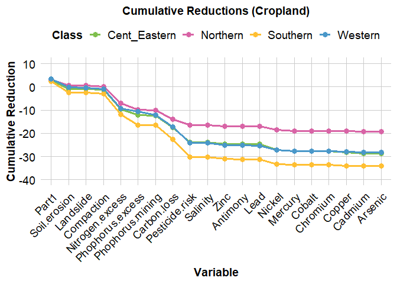
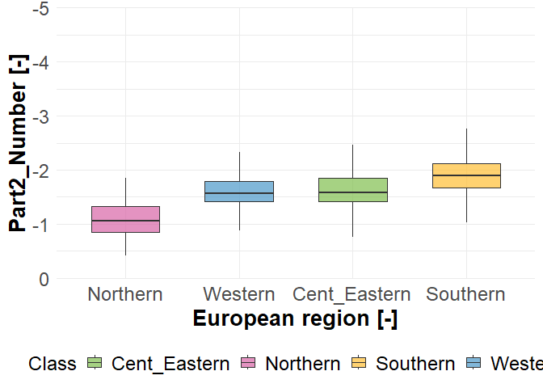
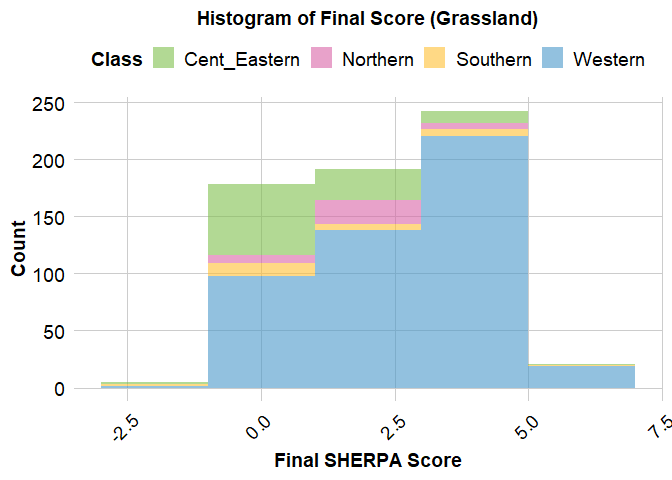
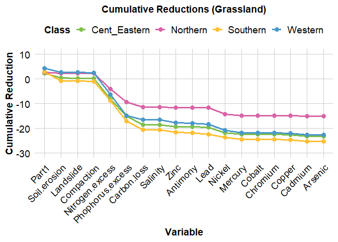

Assessing soil health quantitatively at European scale considering soil
genesis
================
Christine Alewell, Surya Gupta, Jerome Poulenard, Noémie Niquille,
Antonia Kaiser,Nima Shokri, Simon Scheper, Miriam Gross-Schmölders,
David Robinson, GrantCampbell, Cezary Kabala, Friederike Lang, Nancy
Dise, Panos Panagos, Pasquale Borrelli

- [Cropland (Part2)](#cropland-part2)
- [Cropland (Part1)](#cropland-part1)
- [Grassland (Part2)](#grassland-part2)
- [Grassland (Part1)](#grassland-part1)
- [Forest (Part2)](#forest-part2)
- [Forest (Part1)](#forest-part1)

We introduce SHERPA (Soil Health Evaluation, Rating Protocol, and
Assessment) as a framework and present a first assessment across Europe.

LUCAS data [link](https://esdac.jrc.ec.europa.eu/projects/lucas)

ICP forest data [link](http://icp-forests.net/page/data-requests)

The maps used for part1 and part2 can be found here
[link](https://drive.google.com/file/d/1gzNBtUkDcRYhXqcw_QYlVQr2B_8QHRfw/view?usp=sharing)

``` r
##Load the libraries

library(readxl)
library(tidyr)
library(plyr)
library(dplyr)
```

    ## 
    ## Attaching package: 'dplyr'

    ## The following objects are masked from 'package:plyr':
    ## 
    ##     arrange, count, desc, failwith, id, mutate, rename, summarise,
    ##     summarize

    ## The following objects are masked from 'package:stats':
    ## 
    ##     filter, lag

    ## The following objects are masked from 'package:base':
    ## 
    ##     intersect, setdiff, setequal, union

``` r
library(raster)
```

    ## Loading required package: sp

    ## 
    ## Attaching package: 'raster'

    ## The following object is masked from 'package:dplyr':
    ## 
    ##     select

``` r
library(ranger)
library(terra)
```

    ## terra 1.8.54

    ## 
    ## Attaching package: 'terra'

    ## The following object is masked from 'package:tidyr':
    ## 
    ##     extract

``` r
library(Metrics)
library(hexbin)
library(lattice)
library(RColorBrewer)
library(viridis)
```

    ## Loading required package: viridisLite

``` r
library(ggplot2)
library(foreign)
library(tidyverse)
```

    ## ── Attaching core tidyverse packages ──────────────────────── tidyverse 2.0.0 ──
    ## ✔ forcats   1.0.0     ✔ readr     2.1.5
    ## ✔ lubridate 1.9.4     ✔ stringr   1.5.1
    ## ✔ purrr     1.0.4     ✔ tibble    3.2.1

    ## ── Conflicts ────────────────────────────────────────── tidyverse_conflicts() ──
    ## ✖ dplyr::arrange()   masks plyr::arrange()
    ## ✖ purrr::compact()   masks plyr::compact()
    ## ✖ dplyr::count()     masks plyr::count()
    ## ✖ dplyr::desc()      masks plyr::desc()
    ## ✖ terra::extract()   masks raster::extract(), tidyr::extract()
    ## ✖ dplyr::failwith()  masks plyr::failwith()
    ## ✖ dplyr::filter()    masks stats::filter()
    ## ✖ dplyr::id()        masks plyr::id()
    ## ✖ dplyr::lag()       masks stats::lag()
    ## ✖ dplyr::mutate()    masks plyr::mutate()
    ## ✖ dplyr::rename()    masks plyr::rename()
    ## ✖ raster::select()   masks dplyr::select()
    ## ✖ dplyr::summarise() masks plyr::summarise()
    ## ✖ dplyr::summarize() masks plyr::summarize()
    ## ℹ Use the conflicted package (<http://conflicted.r-lib.org/>) to force all conflicts to become errors

``` r
LUCAS_final<- read.csv("C:/Users/surya/Downloads/SHERPA_dataset/Datasets_Sherpa_11_feb/Lucas_data.csv")

colnames(LUCAS_final)
```

    ##  [1] "X"                                         
    ##  [2] "POINTID"                                   
    ##  [3] "OID_"                                      
    ##  [4] "Field1"                                    
    ##  [5] "Depth"                                     
    ##  [6] "pH_CaCl2"                                  
    ##  [7] "pH_H2O"                                    
    ##  [8] "EC"                                        
    ##  [9] "OC"                                        
    ## [10] "CaCO3"                                     
    ## [11] "P"                                         
    ## [12] "N"                                         
    ## [13] "K"                                         
    ## [14] "OC__20_30_cm_"                             
    ## [15] "CaCO3__20_30_cm_"                          
    ## [16] "Ox_Al"                                     
    ## [17] "Ox_Fe"                                     
    ## [18] "NUTS_0"                                    
    ## [19] "NUTS_1"                                    
    ## [20] "NUTS_2"                                    
    ## [21] "NUTS_3"                                    
    ## [22] "TH_LAT"                                    
    ## [23] "TH_LONG"                                   
    ## [24] "SURVEY_DATE"                               
    ## [25] "Elev"                                      
    ## [26] "LC"                                        
    ## [27] "LU"                                        
    ## [28] "LC0_Desc"                                  
    ## [29] "LC1_Desc"                                  
    ## [30] "LU1_Desc"                                  
    ## [31] "Landslide"                                 
    ## [32] "Zinc"                                      
    ## [33] "Antimony"                                  
    ## [34] "Soil_erosion"                              
    ## [35] "Lead"                                      
    ## [36] "Nickel"                                    
    ## [37] "Manganese"                                 
    ## [38] "Mercury"                                   
    ## [39] "Cobalt"                                    
    ## [40] "Chromium"                                  
    ## [41] "Copper"                                    
    ## [42] "Cadmium"                                   
    ## [43] "Arsenic"                                   
    ## [44] "dep_nhx_2015"                              
    ## [45] "dep_nhx_2016"                              
    ## [46] "dep_nhx_2017"                              
    ## [47] "dep_nhx_2018"                              
    ## [48] "dep_nhx_2019"                              
    ## [49] "dep_noy_2015"                              
    ## [50] "dep_noy_2016"                              
    ## [51] "dep_noy_2017"                              
    ## [52] "dep_noy_2018"                              
    ## [53] "dep_noy_2019"                              
    ## [54] "nfer_crop_nh4_2015"                        
    ## [55] "nfer_crop_nh4_2016"                        
    ## [56] "nfer_crop_nh4_2017"                        
    ## [57] "nfer_crop_nh4_2018"                        
    ## [58] "nfer_crop_nh4_2019"                        
    ## [59] "nfer_crop_no3_2015_Kg_N_ha"                
    ## [60] "nfer_crop_no3_2016_Kg_N_ha"                
    ## [61] "nfer_crop_no3_2017_Kg_N_ha"                
    ## [62] "nfer_crop_no3_2018_Kg_N_ha"                
    ## [63] "nfer_crop_no3_2019_Kg_N_ha"                
    ## [64] "nfer_pas_nh4_2015_Kg_N_ha"                 
    ## [65] "nfer_pas_nh4_2016_Kg_N_ha"                 
    ## [66] "nfer_pas_nh4_2017_Kg_N_ha"                 
    ## [67] "nfer_pas_nh4_2018_Kg_N_ha"                 
    ## [68] "nfer_pas_nh4_2019_Kg_N_ha"                 
    ## [69] "nfer_pas_no3_2015_Kg_N_ha"                 
    ## [70] "nfer_pas_no3_2016_Kg_N_ha"                 
    ## [71] "nfer_pas_no3_2017_Kg_N_ha"                 
    ## [72] "nfer_pas_no3_2018_Kg_N_ha"                 
    ## [73] "nfer_pas_no3_2019_Kg_N_ha"                 
    ## [74] "nmanure_app_crop_2015_Kg_N_ha"             
    ## [75] "nmanure_app_crop_2016_Kg_N_ha"             
    ## [76] "nmanure_app_crop_2017_Kg_N_ha"             
    ## [77] "nmanure_app_crop_2018_Kg_N_ha"             
    ## [78] "nmanure_app_crop_2019_Kg_N_ha"             
    ## [79] "nmanure_app_pas_2015_Kg_N_ha"              
    ## [80] "nmanure_app_pas_2016_Kg_N_ha"              
    ## [81] "nmanure_app_pas_2017_Kg_N_ha"              
    ## [82] "nmanure_app_pas_2018_Kg_N_ha"              
    ## [83] "nmanure_app_pas_2019_Kg_N_ha"              
    ## [84] "nmanure_dep_pas_2015_Kg_N_ha"              
    ## [85] "nmanure_dep_pas_2016_Kg_N_ha"              
    ## [86] "nmanure_dep_pas_2017_Kg_N_ha"              
    ## [87] "nmanure_dep_pas_2018_Kg_N_ha"              
    ## [88] "nmanure_dep_pas_2019_Kg_N_ha"              
    ## [89] "Miniral_P_input"                           
    ## [90] "Organic_P_input"                           
    ## [91] "P_export_grain"                            
    ## [92] "P_export_residue"                          
    ## [93] "Multiple_concurrent_soil_erosion_processes"
    ## [94] "Wind"                                      
    ## [95] "Nitrogen_Surplus"

``` r
##This dataset contains all the LUCAS data and the values from different input data from the maps. 

table(LUCAS_final$LC0_Desc)
```

    ## 
    ## Artificial land        Bareland        Cropland       Grassland       Shrubland 
    ##              71             638            7430            3988             720 
    ##           Water        Wetlands        Woodland 
    ##               5              40            6092

``` r
cropland<- LUCAS_final[LUCAS_final$LC0_Desc=="Cropland",]

Grassland<- LUCAS_final[LUCAS_final$LC0_Desc=="Grassland",]

Forestland<- LUCAS_final[LUCAS_final$LC0_Desc=="Woodland",]
```

## Cropland (Part2)

``` r
Cropland1<- cropland[,c(1:95)]

Cropland2<- read.dbf("C:/Users/surya/Downloads/SHERPA_dataset/Datasets_Sherpa_11_feb/Cropland/Cropland_data.dbf")

Cropland2<- Cropland2[,c(2,76:82,84,85)]

Cropland3<- merge(Cropland1,Cropland2, by = "POINTID")

Cropland3$Net_phophorus<- (Cropland3$Miniral_P_input+Cropland3$Organic_P_input)-(Cropland3$P_export_grain+Cropland3$P_export_residue)

Cropland3$EC<- Cropland3$EC/100

Cropland3 <- Cropland3 %>% 
  mutate(Soil_tex_class = case_when(
    textureUSD == -9999 ~ NA_character_,  # Change to NA_character_
    textureUSD == 1 ~ "Clay", 
    textureUSD == 2 ~ "Silty Clay",
    textureUSD == 3 ~ "Silty Clay Loam",
    textureUSD == 4 ~ "Sandy Clay",
    textureUSD == 5 ~ "Sandy Clay Loam",
    textureUSD == 6 ~ "Clay Loam",
    textureUSD == 7 ~ "Silt",
    textureUSD == 8 ~ "Silt Loam",
    textureUSD == 9 ~ "Loam",
    textureUSD == 10 ~ "Sand",
    textureUSD == 11 ~ "Loamy Sand",
    textureUSD == 12 ~ "Sandy Loam"
  ))

############Soil erosion

Cropland3<-Cropland3 %>% mutate(Soil_erosion_number =
                                    case_when(SE == -9999 ~ NA_real_,
                                              SE>= 0 &  SE<=0.5 ~ 0, 
                                              SE> 0.5 &  SE<=1~ 1,
                                              SE> 1 &  SE<=2 ~ 2,
                                              SE> 2 &  SE<=3 ~ 3,
                                              SE> 3 &  SE<=4 ~ 4,
                                              SE> 4 &  SE<=5 ~ 5,
                                              SE> 5 &  SE<=6 ~ 6,
                                              SE> 6 &  SE<=8 ~ 7,
                                              SE> 8 &  SE<=10 ~ 8,
                                              SE> 10 ~ 9
                                    )
)

###########################land slide

Cropland3<-Cropland3 %>% mutate(LS_number =
                                    case_when(LS==1 ~ 6, 
                                              LS==2 ~ 1,
                                              LS==3 ~ 4,
                                              LS== -9999 ~ 0
                                    )
)


#######################Heavy metals

Cropland3<-Cropland3 %>% mutate(Zinc_number =
                                    case_when(Zinc == -9999 ~ NA_real_,
                                              Zinc>= 0 &  Zinc<=33 ~ 0, 
                                              Zinc> 33 &  Zinc<=57~ 1,
                                              Zinc> 57 &  Zinc<=81 ~ 2,
                                              Zinc> 81 &  Zinc<=105 ~ 3,
                                              Zinc> 105 &  Zinc<=129 ~ 4,
                                              Zinc> 129 &  Zinc<=153 ~ 5,
                                              Zinc> 153 &  Zinc<=177 ~ 6,
                                              Zinc> 177 &  Zinc<=201 ~ 7,
                                              Zinc> 201 &  Zinc<=225 ~ 8,
                                              Zinc> 225 ~ 9
                                    )
)

Cropland3<-Cropland3 %>% mutate(Antimony_number =
                                    case_when(Antimony == -9999 ~ NA_real_,
                                              Antimony>= 0 &  Antimony<=0.80 ~ 0, 
                                              Antimony> 0.80 &  Antimony<=1.30 ~ 1,
                                              Antimony> 1.30 &  Antimony<=1.80~ 2,
                                              Antimony> 1.80 &  Antimony<=2.30 ~ 3,
                                              Antimony> 2.30 &  Antimony<=2.80 ~ 4,
                                              Antimony> 2.80 &  Antimony<=3.20 ~ 5,
                                              Antimony> 3.20 &  Antimony<=3.80 ~ 6,
                                              Antimony> 3.80 &  Antimony<=4.30 ~ 7,
                                              Antimony> 4.30 &  Antimony<=5.00 ~ 8,
                                              Antimony> 5 ~ 9
                                    )
)

Cropland3<-Cropland3 %>% mutate(Lead_number =
                                    case_when(Lead == -9999 ~ NA_real_,
                                              Lead>= 0 &  Lead<=23 ~ 0, 
                                              Lead> 23 &  Lead<=42 ~ 1,
                                              Lead> 42 &  Lead<=61~ 2,
                                              Lead> 61 &  Lead<=80 ~ 3,
                                              Lead> 80 &  Lead<=99 ~ 4,
                                              Lead> 99 &  Lead<=118 ~ 5,
                                              Lead> 118 &  Lead<=137 ~ 6,
                                              Lead> 137 &  Lead<=156 ~ 7,
                                              Lead> 156 &  Lead<=175 ~ 8,
                                              Lead> 175 ~ 9
                                    )
)

Cropland3<-Cropland3 %>% mutate(Nickel_number =
                                    case_when(Nickel == -9999 ~ NA_real_,
                                              Nickel>= 0 &  Nickel<=9 ~ 0, 
                                              Nickel> 9 &  Nickel<=14 ~ 1,
                                              Nickel> 14 & Nickel<=20~ 2,
                                              Nickel> 20 &  Nickel<=25 ~ 3,
                                              Nickel> 25 &  Nickel<=31 ~ 4,
                                              Nickel> 31 &  Nickel<=36 ~ 5,
                                              Nickel> 36 &  Nickel<=42 ~ 6,
                                              Nickel> 42 &  Nickel<=47 ~ 7,
                                              Nickel> 47 &  Nickel<=53 ~ 8,
                                              Nickel> 53 ~ 9
                                    )
)

Cropland3<-Cropland3 %>% mutate(Mercury_number =
                                    case_when(Mercury == -9999 ~ NA_real_,
                                              Mercury>= 0 &  Mercury<=23 ~ 0, 
                                              Mercury> 23 &  Mercury<=179 ~ 1,
                                              Mercury> 179 & Mercury<=332~ 2,
                                              Mercury> 332 &  Mercury<=485 ~ 3,
                                              Mercury> 485 &  Mercury<=638 ~ 4,
                                              Mercury> 638 &  Mercury<=791 ~ 5,
                                              Mercury> 791 &  Mercury<=944 ~ 6,
                                              Mercury> 944 &  Mercury<=1097 ~ 7,
                                              Mercury> 1097 &  Mercury<=1250 ~ 8,
                                              Mercury> 1250 ~ 9
                                    )
)

Cropland3<-Cropland3 %>% mutate(Cobalt_number =
                                    case_when(Cobalt == -9999 ~ NA_real_,
                                              Cobalt>= 0 &  Cobalt<=20 ~ 0, 
                                              Cobalt> 20 &  Cobalt<=25 ~ 1,
                                              Cobalt> 25 & Cobalt<=30~ 2,
                                              Cobalt> 30 &  Cobalt<=35 ~ 3,
                                              Cobalt> 35 &  Cobalt<=40 ~ 4,
                                              Cobalt> 40 &  Cobalt<=45 ~ 5,
                                              Cobalt> 45 &  Cobalt<=50 ~ 6,
                                              Cobalt> 50 &  Cobalt<=55 ~ 7,
                                              Cobalt> 55 &  Cobalt<=60 ~ 8,
                                              Cobalt> 60 ~ 9
                                    )
)


Cropland3<-Cropland3 %>% mutate(Chromium_number =
                                  case_when(Chromium == -9999 ~ NA_real_,
                                            Chromium>= 0 &  Chromium<=70 ~ 0, 
                                            Chromium> 70 &  Chromium<=90 ~ 1,
                                            Chromium> 90 & Chromium<=110~ 2,
                                            Chromium> 110 &  Chromium<=130 ~ 3,
                                            Chromium> 130 &  Chromium<=155 ~ 4,
                                            Chromium> 155 &  Chromium<=180 ~ 5,
                                            Chromium> 180 &  Chromium<=205 ~ 6,
                                            Chromium> 205 &  Chromium<=230 ~ 7,
                                            Chromium> 230 &  Chromium<=250 ~ 8,
                                            Chromium> 250 ~ 9
                                  )
)

Cropland3<-Cropland3 %>% mutate(Copper_number =
                                    case_when(Copper == -9999 ~ NA_real_,
                                              Copper>= 0 &  Copper<=22 ~ 0, 
                                              Copper> 22 &  Copper<=32 ~ 1,
                                              Copper> 32 & Copper<=41~ 2,
                                              Copper> 41 &  Copper<=50 ~ 3,
                                              Copper> 50 &  Copper<=59 ~ 4,
                                              Copper> 59 &  Copper<=68 ~ 5,
                                              Copper> 68 &  Copper<=77 ~ 6,
                                              Copper> 77 &  Copper<=86 ~ 7,
                                              Copper> 86 &  Copper<=95 ~ 8,
                                              Copper> 95 ~ 9
                                    )
)

Cropland3<-Cropland3 %>% mutate(Cadmium_number =
                                    case_when(Cadmium == -9999 ~ NA_real_,
                                              Cadmium>= 0 &  Cadmium<=0.5 ~ 0, 
                                              Cadmium> 0.5 &  Cadmium<=0.6 ~ 1,
                                              Cadmium> 0.6 & Cadmium<=0.8~ 2,
                                              Cadmium> 0.8 &  Cadmium<=1.0 ~ 3,
                                              Cadmium> 1.0 &  Cadmium<=1.2 ~ 4,
                                              Cadmium> 1.2 &  Cadmium<=1.4 ~ 5,
                                              Cadmium> 1.4 &  Cadmium<=1.6 ~ 6,
                                              Cadmium> 1.6 &  Cadmium<=1.8 ~ 7,
                                              Cadmium> 1.8 &  Cadmium<=2.0 ~ 8,
                                              Cadmium> 2.0 ~ 9
                                    )
)

Cropland3<-Cropland3 %>% mutate(Arsenic_number =
                                    case_when(Arsenic == -9999 ~ NA_real_,
                                              Arsenic>= 0 &  Arsenic<=10 ~ 0, 
                                              Arsenic> 10 &  Arsenic<=30 ~ 1,
                                              Arsenic> 30 & Arsenic<=50~ 2,
                                              Arsenic> 50 &  Arsenic<=70 ~ 3,
                                              Arsenic> 70 &  Arsenic<=95 ~ 4,
                                              Arsenic> 95 &  Arsenic<=120 ~ 5,
                                              Arsenic> 120 &  Arsenic<=145 ~ 6,
                                              Arsenic> 145 &  Arsenic<=175 ~ 7,
                                              Arsenic> 175 &  Arsenic<=200 ~ 8,
                                              Arsenic> 200 ~ 9
                                    )
)


########################EC

Cropland3<-Cropland3 %>% mutate(EC_number =
                                    case_when(EC == -9999 ~ NA_real_,
                                              EC>= 0 &  EC<=2 ~ 0, 
                                              EC> 2 &  EC<=2.2 ~ 1,
                                              EC> 2.2 & EC<=2.4~ 2,
                                              EC> 2.4 &  EC<=2.6 ~ 3,
                                              EC> 2.6 &  EC<=2.9 ~ 4,
                                              EC> 2.9 &  EC<=3.1 ~ 5,
                                              EC> 3.1 &  EC<=3.4 ~ 6,
                                              EC> 3.4 &  EC<=3.7 ~ 7,
                                              EC> 3.7 &  EC<=4 ~ 8,
                                              EC> 4 ~ 9
                                    )
)


##################Nitrogen

Cropland3<-Cropland3 %>% mutate(Nitrogen_number =
                                    case_when(Nitrogen_Surplus == -9999 ~ NA_real_,
                                              Nitrogen_Surplus<2 ~ 0, 
                                              Nitrogen_Surplus> 2 &  Nitrogen_Surplus<=3 ~ 1,
                                              Nitrogen_Surplus> 3 & Nitrogen_Surplus<=4~ 2,
                                              Nitrogen_Surplus>4 &  Nitrogen_Surplus<=5 ~ 3,
                                              Nitrogen_Surplus> 5 &  Nitrogen_Surplus<=10 ~ 4,
                                              Nitrogen_Surplus> 10 & Nitrogen_Surplus<=15 ~ 5,
                                              Nitrogen_Surplus> 15 &  Nitrogen_Surplus<=20 ~ 6,
                                              Nitrogen_Surplus> 20 &  Nitrogen_Surplus<=25 ~ 7,
                                              Nitrogen_Surplus> 25 & Nitrogen_Surplus<=30 ~ 8,
                                              Nitrogen_Surplus> 30 ~ 9
                                    )
)


Cropland3 <- Cropland3 %>%
  mutate(Phophorus_number_excess = case_when(
    Net_phophorus == -9999 ~ NA_real_,  # Missing value
    Net_phophorus <= 0 ~ 0,  # Assign 0 for all negative values and zero
    Net_phophorus > 0 & Net_phophorus <= 1 ~ 0,  
    Net_phophorus > 1 & Net_phophorus <= 2 ~ 1,
    Net_phophorus > 2 & Net_phophorus <= 3 ~ 2,
    Net_phophorus > 3 & Net_phophorus <= 4 ~ 3,
    Net_phophorus > 4 & Net_phophorus <= 5 ~ 4,
    Net_phophorus > 5 & Net_phophorus <= 6 ~ 5,
    Net_phophorus > 6 & Net_phophorus <= 7 ~ 6,
    Net_phophorus > 7 & Net_phophorus <= 8 ~ 7,
    Net_phophorus > 8 & Net_phophorus <= 9 ~ 8,
    Net_phophorus > 9 ~ 9  # Assign 9 for values greater than 9
  ))


Cropland3 <- Cropland3 %>%
  mutate(Phophorus_number_mining = case_when(
    Net_phophorus == -9999 ~ NA_real_,  # Missing value
    Net_phophorus >= 0 ~ 0,  # Positive values also get score 0
    Net_phophorus < 0 & Net_phophorus >= -0.5 ~ 0, 
    Net_phophorus < -0.5 & Net_phophorus >= -1 ~ 1,
    Net_phophorus < -1 & Net_phophorus >= -2 ~ 2,
    Net_phophorus < -2 & Net_phophorus >= -3 ~ 3,
    Net_phophorus < -3 & Net_phophorus >= -4 ~ 4,
    Net_phophorus < -4 & Net_phophorus >= -5 ~ 5,
    Net_phophorus < -5 & Net_phophorus >= -6 ~ 6,
    Net_phophorus < -6 & Net_phophorus >= -7 ~ 7,
    Net_phophorus < -7 & Net_phophorus >= -8 ~ 8,
    Net_phophorus < -8 ~ 9  # Anything less than -8 gets score 9
  ))

######################################Pesticide

Cropland3 <- Cropland3 %>%
  mutate(Pesticide_Risk_Score = case_when(
    RS <= 0 & AI == 0 ~ 0,  # Negligible risk, no active ingredient
    RS <= 0 & AI >= 0 ~ 1, 
    RS > 0 & RS <= 1 & AI >= 0 & AI <= 10 ~ 2,  # Low risk, AI between 1-10
    RS > 1 & RS <= 2 & AI > 1 & AI <= 10 ~ 3,  # Medium-low risk, AI between 1-10
    RS > 1 & RS <= 2 & AI > 10 & AI <= 20 ~ 4, # Medium-low risk, AI between 10-20
    RS > 2 & RS <= 3 & AI > 1 & AI <= 10 ~ 5,  # Medium risk, AI between 1-10
    RS > 2 & RS <= 3 & AI > 10 & AI <= 20 ~ 6, # Medium risk, AI between 10-20
    RS > 3 & RS <= 4 & AI > 1 & AI <= 10 ~ 7,  # High risk, AI between 1-10
    RS > 3 & RS <= 4 & AI > 10 & AI <= 20 ~ 8, # High risk, AI between 10-20
    RS > 4 & AI > 10 ~ 9,  # Very high risk, AI greater than 10
    TRUE ~ NA_real_  # Assign NA for unclassified cases
  ))


###################################SOC loss

Cropland3$OC1<- Cropland3$OC/10

Cropland3 <- Cropland3 %>%
  mutate(
    Stock_carb = ifelse(Stock_carb == -9999, NA, Stock_carb),
    OC1 = ifelse(OC1 == -9999, NA, OC1),
    
    SOC_score_loss1 = case_when(
      # Stable or increasing SOC
      Stock_carb >= 0 & OC1 >= 5                   ~ 0,
      Stock_carb >= 0 & OC1 >= 2.5 & OC1 < 5  ~ 0,
      Stock_carb >= 0 & OC1 >= 1   & OC1 < 2.5 ~ 0,
      Stock_carb >= 0 & OC1 >= 0.5 & OC1 < 1   ~ 0,
      
      # Loss <0 to -0.5
      Stock_carb < 0   & Stock_carb >= -0.5 & OC1 >= 5                   ~ 1,
      Stock_carb < 0   & Stock_carb >= -0.5 & OC1>= 2.5 & OC1 < 5  ~ 2,
      Stock_carb < 0   & Stock_carb >= -0.5 & OC1 >= 1   & OC1 < 2.5 ~ 4,
      Stock_carb < 0   & Stock_carb >= -0.5 & OC1 >= 0.5 & OC1 < 1   ~ 6,
      
      # Loss < -0.5 to -1.5
      Stock_carb < -0.5 & Stock_carb >= -1.5 & OC1 >= 5                   ~ 2,
      Stock_carb < -0.5 & Stock_carb >= -1.5 & OC1 >= 2.5 & OC1 < 5  ~ 3,
      Stock_carb < -0.5 & Stock_carb >= -1.5 & OC1 >= 1   & OC1 < 2.5 ~ 5,
      Stock_carb < -0.5 & Stock_carb >= -1.5 & OC1 >= 0.5 & OC1 < 1   ~ 7,
      
      # Loss < -1.5 to -3
      Stock_carb < -1.5 & Stock_carb >= -3 & OC1 >= 5                   ~ 3,
      Stock_carb < -1.5 & Stock_carb >= -3 & OC1 >= 2.5 & OC1 < 5  ~ 4,
      Stock_carb < -1.5 & Stock_carb >= -3 & OC1 >= 1   & OC1 < 2.5 ~ 6,
      Stock_carb < -1.5 & Stock_carb >= -3 & OC1 >= 0.5 & OC1 < 1   ~ 8,
      
      # Loss < -3 to -4
      Stock_carb < -3 & Stock_carb >= -4 & OC1 >= 5                   ~ 4,
      Stock_carb < -3 & Stock_carb >= -4 & OC1 >= 2.5 & OC1 < 5  ~ 5,
      Stock_carb < -3 & Stock_carb >= -4 & OC1 >= 1   & OC1 < 2.5 ~ 7,
      Stock_carb < -3 & Stock_carb >= -4 & OC1 >= 0.5 & OC1 < 1   ~ 9,
      
      # Loss < -4 to -5
      Stock_carb < -4 & Stock_carb >= -5 & OC1 >= 5                   ~ 5,
      Stock_carb < -4 & Stock_carb >= -5 & OC1 >= 2.5 & OC1 < 5  ~ 6,
      Stock_carb < -4 & Stock_carb >= -5 & OC1 >= 1   & OC1 < 2.5 ~ 8,
      Stock_carb < -4 & Stock_carb >= -5 & OC1 >= 0.5 & OC1 < 1   ~ 9,
      
      # Loss < -5 to -6
      Stock_carb < -5 & Stock_carb >= -6 & OC1 >= 5                   ~ 6,
      Stock_carb < -5 & Stock_carb >= -6 & OC1 >= 2.5 & OC1 < 5  ~ 7,
      Stock_carb < -5 & Stock_carb >= -6 & OC1 >= 1   & OC1 < 2.5 ~ 9,
      Stock_carb < -5 & Stock_carb >= -6 & OC1 >= 0.5 & OC1 < 1   ~ 9,
      
      # Loss < -6 to -7
      Stock_carb < -6 & Stock_carb >= -7 & OC1 >= 5                   ~ 7,
      Stock_carb < -6 & Stock_carb >= -7 & OC1 >= 2.5 & OC1 < 5  ~ 8,
      Stock_carb < -6 & Stock_carb >= -7 & OC1 >= 1   & OC1 < 2.5 ~ 9,
      Stock_carb < -6 & Stock_carb >= -7 & OC1 >= 0.5 & OC1 < 1   ~ 9,
      
      # Loss < -7 to -8
      Stock_carb < -7 & Stock_carb >= -8 & OC1 >= 5                   ~ 8,
      Stock_carb < -7 & Stock_carb >= -8 & OC1 >= 2.5 & OC1 < 5  ~ 9,
      Stock_carb < -7 & Stock_carb >= -8 & OC1 >= 1   & OC1 < 2.5 ~ 9,
      Stock_carb < -7 & Stock_carb >= -8 & OC1 >= 0.5 & OC1 < 1   ~ 9,
      
      # Loss < -8
      Stock_carb < -8 & OC1 >= 5                   ~ 9,
      Stock_carb < -8 & OC1 >= 2.5 & OC1 < 5  ~ 9,
      Stock_carb < -8 & OC1 >= 1   & OC1 < 2.5 ~ 9,
      Stock_carb < -8 & OC1 >= 0.5 & OC1 < 1   ~ 9,
      
      TRUE ~ NA_real_
    )
  )
Cropland3$SOC_clay_ratio<- (Cropland3$OC1/Cropland3$Clay)

Cropland3 <- Cropland3 %>%
  mutate(SOC_clay_raio_number = case_when(
    SOC_clay_ratio == -9999 ~ NA_real_,                 
    SOC_clay_ratio >= 0.125 ~ 0,                        
    SOC_clay_ratio < 0.125 & SOC_clay_ratio >= 0.111 ~ 1,  
    SOC_clay_ratio < 0.111 & SOC_clay_ratio >= 0.1   ~ 3,  
    SOC_clay_ratio < 0.1   & SOC_clay_ratio >= 0.090 ~ 5,  
    SOC_clay_ratio < 0.090 & SOC_clay_ratio >= 0.0833 ~ 7, 
    SOC_clay_ratio < 0.0833 & SOC_clay_ratio >= 0.077 ~ 8, 
    SOC_clay_ratio < 0.077 ~ 9                          
  ))

Cropland3 <- Cropland3 %>%
  mutate(SOC_score2 = case_when(
    OC1 > 5               ~ 0,
    OC1 > 4.5 & OC1 <= 5  ~ 1,
    OC1 > 4   & OC1 <= 4.5  ~ 2,
    OC1 > 3.5 & OC1 <= 4    ~ 3,
    OC1 > 3   & OC1 <= 3.5  ~ 4,
    OC1 > 2.5 & OC1 <= 3    ~ 5,
    OC1 > 2   & OC1 <= 2.5  ~ 6,
    OC1 > 1.5 & OC1 <= 2    ~ 7,
    OC1 > 0.5 & OC1 <= 1.5  ~ 8,
    OC1 <= 0.5                     ~ 9,
    TRUE                                ~ NA_real_  
  ))

#Grassland4$soc_final_number<- (Grassland4$SOC_clay_raio_number + Grassland4$SOC_score2)/2

Cropland3$soc_final_number<- (Cropland3$SOC_clay_raio_number + Cropland3$SOC_score2+Cropland3$SOC_score_loss1)/3

#########################################compaction

Cropland3 <- Cropland3 %>%
  mutate(BD = ifelse(BD == -9999, NA, BD)) %>%  # Convert BD -9999 to NA
  mutate(Soil_bulk_density_score = case_when(
    Soil_tex_class == -9999 ~ NA_real_,
    Soil_tex_class == "Clay" ~ ifelse(BD < 1.10, 0, ifelse(BD >= 1.10 & BD <= 1.47, 3, 9)),   
    Soil_tex_class == "Clay Loam" ~ ifelse(BD < 1.40, 0, ifelse(BD >= 1.40 & BD <= 1.75, 3, 9)),   
    Soil_tex_class == "Loam" ~ ifelse(BD < 1.40, 0, ifelse(BD >= 1.40 & BD <= 1.80, 3, 9)),   
    Soil_tex_class == "Loamy Sand" ~ ifelse(BD < 1.60, 0, ifelse(BD >= 1.60 & BD <= 1.80, 3, 9)),  
    Soil_tex_class == "Sand" ~ ifelse(BD < 1.60, 0, ifelse(BD >= 1.60 & BD <= 1.80, 3, 9)),   
    Soil_tex_class == "Sandy Clay Loam" ~ ifelse(BD < 1.40, 0, ifelse(BD >= 1.40 & BD <= 1.75, 3, 9)),   
    Soil_tex_class == "Sandy Loam" ~ ifelse(BD < 1.40, 0, ifelse(BD >= 1.40 & BD <= 1.80, 3, 9)),   
    Soil_tex_class == "Silt Loam" ~ ifelse(BD < 1.40, 0, ifelse(BD >= 1.40 & BD <= 1.65, 3, 9)),   
    Soil_tex_class == "Silty Clay" ~ ifelse(BD < 1.10, 0, ifelse(BD >= 1.10 & BD <= 1.58, 3, 9)),   
    Soil_tex_class == "Silty Clay Loam" ~ ifelse(BD < 1.40, 0, ifelse(BD >= 1.40 & BD <= 1.65, 3, 9)),   
    TRUE ~ NA_real_  # Assign NA for unrecognized texture names
  ))


Cropland3$Part1_number<- Cropland3$Nitrogen_number+Cropland3$EC_number+Cropland3$Arsenic_number+Cropland3$Cadmium_number+
  Cropland3$Copper_number+Cropland3$Chromium_number+Cropland3$Cobalt_number+Cropland3$Mercury_number+Cropland3$Nickel_number+Cropland3$Lead_number+Cropland3$Antimony_number+
  Cropland3$Zinc_number+Cropland3$Soil_erosion_number+Cropland3$Phophorus_number_excess+Cropland3$Phophorus_number_mining+Cropland3$Soil_bulk_density_score+
  Cropland3$Pesticide_Risk_Score+Cropland3$LS_number+Cropland3$soc_final_number

Cropland3<- Cropland3[!is.na(Cropland3$Part1_number),]

Cropland3$Part1_number_avg<- (Cropland3$Part1_number)/19

hist(Cropland3$Part1_number_avg)
```

<!-- -->

``` r
## Regional variability in Part2 scores across Europe and comparison with Panagos et al. (2024) soil degradation process data (see Figure S2.1 in SI2 document)

All_data_BO<- read.csv("C:/Users/surya/Downloads/SHERPA_dataset/Cropl_land_Eur_reg1.csv")

All_data_BO<- All_data_BO[,c(6,121)]

colnames(All_data_BO)
```

    ## [1] "POINTID" "Class"

``` r
All_data_BO<- merge(Cropland3, All_data_BO, by = "POINTID")

All_data_BO<- All_data_BO[All_data_BO$Sum_data_1<126,]

All_data_BO<- All_data_BO[All_data_BO$Sum_data_1>-1,]

counts <- All_data_BO %>%
  group_by(Class) %>%
  summarise(Count = n())

All_data_BO$part22<- 0-All_data_BO$Part1_number_avg

my_colors <- c(
  c("#7fbf4d","#d864a6","#ffbf33","#4a98c9") 
)

level_order <- c('Northern', 'Western', 'Cent_Eastern', 'Southern') 

p <- ggplot(All_data_BO, aes(x = factor(Class, level = level_order), y = part22, fill = Class)) + 
  geom_boxplot(outlier.shape = NA, width = 0.6, alpha = 0.7, position = position_dodge(width = 0.75)) +  # Separate boxplots
  # Separate points
  labs(x = "European region [-]",
       y = "Part2_Number [-]") +  # Add title
  theme_minimal(base_size = 15) +  # Clean background
  theme(
    axis.text = element_text(size = 18),
    axis.title = element_text(size = 20, face = "bold"),
    plot.title = element_text(size = 22, face = "bold", hjust = 0.5),  # Centered title
    legend.position = "bottom",
    legend.text = element_text(size = 18),
    legend.title = element_text(size = 18)
  ) +
  scale_y_reverse(limits = c(0, -5), expand = c(0, 0)) +  # Set limits and remove extra space
  scale_fill_manual(values = my_colors) +  # Apply custom colors to fill
  scale_color_manual(values = my_colors)  # Apply custom colors to points

print(p)
```

<!-- -->

## Cropland (Part1)

``` r
Cropland1$mean_dep_nhx<-(Cropland1$dep_nhx_2015+ Cropland1$dep_nhx_2016+Cropland1$dep_nhx_2017+Cropland1$dep_nhx_2018+Cropland1$dep_nhx_2019)/5

Cropland1$mean_dep_noy<-(Cropland1$dep_noy_2015+ Cropland1$dep_noy_2016+Cropland1$dep_noy_2017+Cropland1$dep_noy_2018+Cropland1$dep_noy_2019)/5

Cropland1$mean_nfer_crop_nh4<-(Cropland1$nfer_crop_nh4_2015+ Cropland1$nfer_crop_nh4_2016+Cropland1$nfer_crop_nh4_2017+
                                 Cropland1$nfer_crop_nh4_2018+Cropland1$nfer_crop_nh4_2019)/5

Cropland1$mean_nfer_crop_no3<-(Cropland1$nfer_crop_no3_2015_Kg_N_ha+ Cropland1$nfer_crop_no3_2016_Kg_N_ha+Cropland1$nfer_crop_no3_2017_Kg_N_ha+
                                 Cropland1$nfer_crop_no3_2018_Kg_N_ha+Cropland1$nfer_crop_no3_2019_Kg_N_ha)/5

Cropland1$mean_nmanure_app_crop<-(Cropland1$nmanure_app_crop_2015_Kg_N_ha+ Cropland1$nmanure_app_crop_2016_Kg_N_ha+Cropland1$nmanure_app_crop_2017_Kg_N_ha+
                                    Cropland1$nmanure_app_crop_2018_Kg_N_ha+Cropland1$nmanure_app_crop_2019_Kg_N_ha)/5


Cropland1$Sum_fer_manure<- Cropland1$mean_nfer_crop_nh4+Cropland1$mean_nfer_crop_no3+Cropland1$mean_nmanure_app_crop

Cropland1$sum_fertilizer<- Cropland1$mean_nfer_crop_nh4+Cropland1$mean_nfer_crop_no3

Cropland1$percent_fer_manure<- (Cropland1$sum_fertilizer/Cropland1$Sum_fer_manure)*100

Cropland1$percent_manure<- (Cropland1$mean_nmanure_app_crop/Cropland1$Sum_fer_manure)*100

 hist(Cropland1$percent_manure)
```

<!-- -->

``` r
grid <- list.files("C:/Users/surya/Downloads/Fcover_data_2018_NC/First_four_months/" , pattern = "*.tif$")
 All_cov <- raster::stack(paste0("C:/Users/surya/Downloads/Fcover_data_2018_NC/First_four_months/", grid))
 
 sp.pnts = Cropland1[,c("TH_LONG", "TH_LAT")]
 data<- terra::extract(All_cov,sp.pnts)
 Cropland1<- cbind(Cropland1,data)
 
 Cropland1$Mean_2018_Fcover1<- Cropland1$Mean_2018_Fcover*100
 
 Cropland1 <- Cropland1 %>% 
   mutate(Fcover_number = case_when(
     Mean_2018_Fcover1 >= 80 & Mean_2018_Fcover1 <= 100 ~ 10,  
     Mean_2018_Fcover1 < 80 & Mean_2018_Fcover1 >= 75 ~ 9,
     Mean_2018_Fcover1 < 75 & Mean_2018_Fcover1 >= 70 ~ 8,
     Mean_2018_Fcover1 < 70 & Mean_2018_Fcover1 >= 65 ~ 7,
     Mean_2018_Fcover1 < 65 & Mean_2018_Fcover1 >= 60 ~ 6,
     Mean_2018_Fcover1 < 60 & Mean_2018_Fcover1 >= 55 ~ 5,
     Mean_2018_Fcover1 < 55 & Mean_2018_Fcover1 >= 50 ~ 4,
     Mean_2018_Fcover1 < 50 & Mean_2018_Fcover1 >= 45 ~ 3,
     Mean_2018_Fcover1 < 45 & Mean_2018_Fcover1 >= 40 ~ 2,
     Mean_2018_Fcover1 < 40 ~ 1
   ))

 Cropland1 <- Cropland1 %>%
   mutate(Fertilizer_type_number = case_when(
     percent_manure == 100 ~ 10,  # Organic fertilizer only
     percent_manure == 0 ~ 1,  # Mineral fertilizer only
     percent_manure >= 95 & percent_manure <= 100 ~ 9,
     percent_manure < 95 & percent_manure >= 80 ~ 8,
     percent_manure < 80 & percent_manure >= 65 ~ 7,
     percent_manure < 65 & percent_manure >= 50 ~ 6,
     percent_manure < 50 & percent_manure >= 35 ~ 5,
     percent_manure < 35 & percent_manure >= 20 ~ 4,
     percent_manure < 20 & percent_manure >= 10 ~ 3,
     percent_manure < 10 & percent_manure > 0 ~ 2
   ))

Cropland1$Part2<- (Cropland1$Fcover_number+Cropland1$Fertilizer_type_number)/2

All_data_BO<- read.csv("C:/Users/surya/Downloads/SHERPA_dataset/Cropl_land_Eur_reg1.csv")


All_data_BO<- All_data_BO[,c(6,121)]

Cropland_part1<- merge(Cropland3, All_data_BO, by="POINTID")


Cropland6<- Cropland1[,c(2,109)]

Cropland7<- merge(Cropland_part1, Cropland6, by = "POINTID")


Cropland7$Final_number<- Cropland7$Part2-Cropland7$Part1_number_avg

Cropland7<- Cropland7[!is.na(Cropland7$Final_number),]


nrow(Cropland7)
```

    ## [1] 3534

``` r
Cropland7<- Cropland7[,c(1,84:135)]


old_names <- c(
  "Soil_erosion_number", "LS_number", "Zinc_number", "Antimony_number", "Lead_number",
  "Nickel_number", "Mercury_number", "Cobalt_number", "Chromium_number", "Copper_number",
  "Cadmium_number", "Arsenic_number", "EC_number", "Nitrogen_number",
  "Phophorus_number_excess", "Phophorus_number_mining", "Pesticide_Risk_Score", "soc_final_number",
  "Soil_bulk_density_score", "Part1_number_avg","Part2", "Final_number"
)

new_names <- c(
  "Soil.erosion", "Landslide", "Zinc", "Antimony", "Lead",
  "Nickel", "Mercury", "Cobalt", "Chromium", "Copper",
  "Cadmium", "Arsenic", "Salinity", "Nitrogen.excess",
  "Phophorus.excess", "Phophorus.mining", "Pesticide.risk", "Carbon.loss",
  "Compaction", "Part2", "Part1","Final_number"
)


Cropland7 <- Cropland7 %>% rename(!!!setNames(old_names,new_names))


Part1_part2_grassland <- Cropland7 %>%
  mutate(Class = as.character(Class))  # Convert Class to character if needed


# Compute mean based on Class
Part1_part2_grassland_avg <- Part1_part2_grassland %>%
  group_by(Class) %>%
  summarise(across(where(is.numeric), ~mean(.x, na.rm = TRUE)))

variable_order <- c(
  "Part1","Soil.erosion","Landslide", "Compaction", "Nitrogen.excess",
  "Phophorus.excess","Phophorus.mining", "Carbon.loss", "Pesticide.risk", "Salinity", "Zinc",
  "Antimony", "Lead", "Nickel", "Mercury",
  "Cobalt", "Chromium", "Copper", "Cadmium",
  "Arsenic"
)
# Transform the data to long format and filter variables
data_long <- Part1_part2_grassland_avg %>%
  dplyr::select(all_of(c("Class", variable_order))) %>%  # Select required variables
  pivot_longer(cols = -Class,
               names_to = "Variable",
               values_to = "Value") %>%
  mutate(Variable = factor(Variable, levels = variable_order)) %>%  # Order variables
  group_by(Class) %>%
  arrange(Class, Variable) %>%  # Ensure correct order for cumulative calculation
  mutate(Cumulative = if_else(Variable == "Part1", Value, NA_real_)) %>%  # Initialize Cumulative
  mutate(Cumulative = replace(Cumulative, is.na(Cumulative),
                              first(Cumulative, order_by = Variable) - cumsum(Value[Variable != "Part1"]))) %>%
  ungroup()


# Convert Class to a factor (ensures correct color mapping)
  Cropland7$Class <- as.factor(Cropland7$Class)
  data_long$Class <- as.factor(data_long$Class)
  
# Define custom colors (Make sure these match actual class names)
# Define custom colors based on the figure colors
class_colors <- c("#7fbf4d","#d864a6","#ffbf33","#4a98c9") 

 # Histogram Plot
  ggplot(Cropland7, aes(x = Final_number, fill = Class)) +
    geom_histogram(binwidth = 2, alpha = 0.6, position = "stack") +
    labs(title = "Histogram of Final Score (Cropland)",
         x = "Final SHERPA Score",
         y = "Count") +
    scale_fill_manual(values = class_colors) +  # Apply color mapping
    theme_minimal(base_size = 14) +
  theme(
    axis.text.x = element_text(angle = 45, hjust = 1, size = 14, color = "black"),
    axis.text.y = element_text(size = 14, color = "black"),
    axis.title.x = element_text(size = 14, face = "bold"),
    axis.title.y = element_text(size = 14, face = "bold"),
    plot.title = element_text(size = 14, face = "bold", hjust = 0.5),
    panel.grid.major = element_line(color = "gray80"),
    panel.grid.minor = element_blank(),
    legend.position = "top",
    legend.title = element_text(size = 14, face = "bold"),
    legend.text = element_text(size = 14)
  )
```

<!-- -->

``` r
# Line Plot
ggplot(data_long, aes(x = Variable, y = Cumulative, color = Class, group = Class)) +
  geom_line(size = 1.2) +
  geom_point(size = 3) +
  scale_y_continuous(limits = c(-40, 10)) +
  scale_color_manual(values = class_colors) +  # Apply color mapping
  labs(
    title = "Cumulative Reductions (Cropland)",
    x = "Variable",
    y = "Cumulative Reduction",
    color = "Class"
  ) +
 theme_minimal(base_size = 14) +
  theme(
    axis.text.x = element_text(angle = 45, hjust = 1, size = 14, color = "black"),
    axis.text.y = element_text(size = 14, color = "black"),
    axis.title.x = element_text(size = 14, face = "bold"),
    axis.title.y = element_text(size = 14, face = "bold"),
    plot.title = element_text(size = 14, face = "bold", hjust = 0.5),
    panel.grid.major = element_line(color = "gray80"),
    panel.grid.minor = element_blank(),
    legend.position = "top",
    legend.title = element_text(size = 14, face = "bold"),
    legend.text = element_text(size = 14)
  )
```

<!-- -->

## Grassland (Part2)

``` r
Grassland2<- Grassland[,c(1:52, 78:95)]

Grassland2$Net_phophorus<- (Grassland2$Miniral_P_input+Grassland2$Organic_P_input)
 
Grassland2$EC<- Grassland2$EC/100

Grassland4<- Grassland2[!is.na(Grassland2$Net_phophorus),]
 
## the new file is loaded because the current dataset was missing the carbon stock, Bulk density, land slide density,
## Risk score, Active ingredient, and soil texture class 

##read grassland_data
Grassland5<- read.dbf("C:/Users/surya/Downloads/SHERPA_dataset/Datasets_Sherpa_11_feb/Grassland_data.dbf")

Grassland5<- Grassland5[,c(2,72:79)]

Grassland4<- merge(Grassland4, Grassland5, by = "POINTID")


############Soil texture

Grassland4 <- Grassland4 %>% 
  mutate(Soil_tex_class = case_when(
    textureUSD == -9999 ~ NA_character_,  # Change to NA_character_
    textureUSD == 1 ~ "Clay", 
    textureUSD == 2 ~ "Silty Clay",
    textureUSD == 3 ~ "Silty Clay Loam",
    textureUSD == 4 ~ "Sandy Clay",
    textureUSD == 5 ~ "Sandy Clay Loam",
    textureUSD == 6 ~ "Clay Loam",
    textureUSD == 7 ~ "Silt",
    textureUSD == 8 ~ "Silt Loam",
    textureUSD == 9 ~ "Loam",
    textureUSD == 10 ~ "Sand",
    textureUSD == 11 ~ "Loamy Sand",
    textureUSD == 12 ~ "Sandy Loam"
  ))

############Soil erosion

Grassland4<-Grassland4 %>% mutate(Soil_erosion_number =
                              case_when(Soil_erosion == -9999 ~ NA_real_,
                                Soil_erosion>= 0 &  Soil_erosion<=0.5 ~ 0, 
                                        Soil_erosion> 0.5 &  Soil_erosion<=1~ 1,
                                        Soil_erosion> 1 &  Soil_erosion<=2 ~ 2,
                                        Soil_erosion> 2 &  Soil_erosion<=3 ~ 3,
                                        Soil_erosion> 3 &  Soil_erosion<=4 ~ 4,
                                        Soil_erosion> 4 &  Soil_erosion<=5 ~ 5,
                                        Soil_erosion> 5 &  Soil_erosion<=6 ~ 6,
                                        Soil_erosion> 6 &  Soil_erosion<=8 ~ 7,
                                        Soil_erosion> 8 &  Soil_erosion<=10 ~ 8,
                                        Soil_erosion> 10 ~ 9
                              )
)

###########################landslide density

Grassland4<-Grassland4 %>% mutate(LS_number =
                                    case_when(LS==1 ~ 6, 
                                              LS==2 ~ 1,
                                              LS==3 ~ 4,
                                              LS== -9999 ~ 0
                                    )
)


#######################Heavy metals

Grassland4<-Grassland4 %>% mutate(Zinc_number =
                                    case_when(Zinc == -9999 ~ NA_real_,
                                      Zinc>= 0 &  Zinc<=33 ~ 0, 
                                              Zinc> 33 &  Zinc<=57~ 1,
                                              Zinc> 57 &  Zinc<=81 ~ 2,
                                              Zinc> 81 &  Zinc<=105 ~ 3,
                                              Zinc> 105 &  Zinc<=129 ~ 4,
                                              Zinc> 129 &  Zinc<=153 ~ 5,
                                              Zinc> 153 &  Zinc<=177 ~ 6,
                                              Zinc> 177 &  Zinc<=201 ~ 7,
                                              Zinc> 201 &  Zinc<=225 ~ 8,
                                              Zinc> 225 ~ 9
                                    )
)

Grassland4<-Grassland4 %>% mutate(Antimony_number =
                                    case_when(Antimony == -9999 ~ NA_real_,
                                      Antimony>= 0 &  Antimony<=0.80 ~ 0, 
                                              Antimony> 0.80 &  Antimony<=1.30 ~ 1,
                                              Antimony> 1.30 &  Antimony<=1.80~ 2,
                                              Antimony> 1.80 &  Antimony<=2.30 ~ 3,
                                              Antimony> 2.30 &  Antimony<=2.80 ~ 4,
                                              Antimony> 2.80 &  Antimony<=3.20 ~ 5,
                                              Antimony> 3.20 &  Antimony<=3.80 ~ 6,
                                              Antimony> 3.80 &  Antimony<=4.30 ~ 7,
                                              Antimony> 4.30 &  Antimony<=5.00 ~ 8,
                                              Antimony> 5 ~ 9
                                    )
)

Grassland4<-Grassland4 %>% mutate(Lead_number =
                                    case_when(Lead == -9999 ~ NA_real_,
                                      Lead>= 0 &  Lead<=23 ~ 0, 
                                              Lead> 23 &  Lead<=42 ~ 1,
                                              Lead> 42 &  Lead<=61~ 2,
                                              Lead> 61 &  Lead<=80 ~ 3,
                                              Lead> 80 &  Lead<=99 ~ 4,
                                              Lead> 99 &  Lead<=118 ~ 5,
                                              Lead> 118 &  Lead<=137 ~ 6,
                                              Lead> 137 &  Lead<=156 ~ 7,
                                              Lead> 156 &  Lead<=175 ~ 8,
                                              Lead> 175 ~ 9
                                    )
)

Grassland4<-Grassland4 %>% mutate(Nickel_number =
                                    case_when(Nickel == -9999 ~ NA_real_,
                                      Nickel>= 0 &  Nickel<=9 ~ 0, 
                                              Nickel> 9 &  Nickel<=14 ~ 1,
                                              Nickel> 14 & Nickel<=20~ 2,
                                              Nickel> 20 &  Nickel<=25 ~ 3,
                                              Nickel> 25 &  Nickel<=31 ~ 4,
                                              Nickel> 31 &  Nickel<=36 ~ 5,
                                              Nickel> 36 &  Nickel<=42 ~ 6,
                                              Nickel> 42 &  Nickel<=47 ~ 7,
                                              Nickel> 47 &  Nickel<=53 ~ 8,
                                              Nickel> 53 ~ 9
                                    )
)

Grassland4<-Grassland4 %>% mutate(Mercury_number =
                                    case_when(Mercury == -9999 ~ NA_real_,
                                      Mercury>= 0 &  Mercury<=23 ~ 0, 
                                              Mercury> 23 &  Mercury<=179 ~ 1,
                                              Mercury> 179 & Mercury<=332~ 2,
                                              Mercury> 332 &  Mercury<=485 ~ 3,
                                              Mercury> 485 &  Mercury<=638 ~ 4,
                                              Mercury> 638 &  Mercury<=791 ~ 5,
                                              Mercury> 791 &  Mercury<=944 ~ 6,
                                              Mercury> 944 &  Mercury<=1097 ~ 7,
                                              Mercury> 1097 &  Mercury<=1250 ~ 8,
                                              Mercury> 1250 ~ 9
                                    )
)

Grassland4<-Grassland4 %>% mutate(Cobalt_number =
                                    case_when(Cobalt == -9999 ~ NA_real_,
                                      Cobalt>= 0 &  Cobalt<=20 ~ 0, 
                                              Cobalt> 20 &  Cobalt<=25 ~ 1,
                                              Cobalt> 25 & Cobalt<=30~ 2,
                                              Cobalt> 30 &  Cobalt<=35 ~ 3,
                                              Cobalt> 35 &  Cobalt<=40 ~ 4,
                                              Cobalt> 40 &  Cobalt<=45 ~ 5,
                                              Cobalt> 45 &  Cobalt<=50 ~ 6,
                                              Cobalt> 50 &  Cobalt<=55 ~ 7,
                                              Cobalt> 55 &  Cobalt<=60 ~ 8,
                                              Cobalt> 60 ~ 9
                                    )
)


Grassland4<-Grassland4 %>% mutate(Chromium_number =
                                                case_when(Chromium == -9999 ~ NA_real_,
                                                          Chromium>= 0 &  Chromium<=70 ~ 0, 
                                                          Chromium> 70 &  Chromium<=90 ~ 1,
                                                          Chromium> 90 & Chromium<=110~ 2,
                                                          Chromium> 110 &  Chromium<=130 ~ 3,
                                                          Chromium> 130 &  Chromium<=155 ~ 4,
                                                          Chromium> 155 &  Chromium<=180 ~ 5,
                                                          Chromium> 180 &  Chromium<=205 ~ 6,
                                                          Chromium> 205 &  Chromium<=230 ~ 7,
                                                          Chromium> 230 &  Chromium<=250 ~ 8,
                                                          Chromium> 250 ~ 9
                                                )
)

Grassland4<-Grassland4 %>% mutate(Copper_number =
                                    case_when(Copper == -9999 ~ NA_real_,
                                      Copper>= 0 &  Copper<=22 ~ 0, 
                                              Copper> 22 &  Copper<=32 ~ 1,
                                              Copper> 32 & Copper<=41~ 2,
                                              Copper> 41 &  Copper<=50 ~ 3,
                                              Copper> 50 &  Copper<=59 ~ 4,
                                              Copper> 59 &  Copper<=68 ~ 5,
                                              Copper> 68 &  Copper<=77 ~ 6,
                                              Copper> 77 &  Copper<=86 ~ 7,
                                              Copper> 86 &  Copper<=95 ~ 8,
                                              Copper> 95 ~ 9
                                    )
)

Grassland4<-Grassland4 %>% mutate(Cadmium_number =
                                    case_when(Cadmium == -9999 ~ NA_real_,
                                      Cadmium>= 0 &  Cadmium<=0.5 ~ 0, 
                                              Cadmium> 0.5 &  Cadmium<=0.6 ~ 1,
                                              Cadmium> 0.6 & Cadmium<=0.8~ 2,
                                              Cadmium> 0.8 &  Cadmium<=1.0 ~ 3,
                                              Cadmium> 1.0 &  Cadmium<=1.2 ~ 4,
                                              Cadmium> 1.2 &  Cadmium<=1.4 ~ 5,
                                              Cadmium> 1.4 &  Cadmium<=1.6 ~ 6,
                                              Cadmium> 1.6 &  Cadmium<=1.8 ~ 7,
                                              Cadmium> 1.8 &  Cadmium<=2.0 ~ 8,
                                              Cadmium> 2.0 ~ 9
                                    )
)

Grassland4<-Grassland4 %>% mutate(Arsenic_number =
                                    case_when(Arsenic == -9999 ~ NA_real_,
                                      Arsenic>= 0 &  Arsenic<=10 ~ 0, 
                                              Arsenic> 10 &  Arsenic<=30 ~ 1,
                                              Arsenic> 30 & Arsenic<=50~ 2,
                                              Arsenic> 50 &  Arsenic<=70 ~ 3,
                                              Arsenic> 70 &  Arsenic<=95 ~ 4,
                                              Arsenic> 95 &  Arsenic<=120 ~ 5,
                                              Arsenic> 120 &  Arsenic<=145 ~ 6,
                                              Arsenic> 145 &  Arsenic<=175 ~ 7,
                                              Arsenic> 175 &  Arsenic<=200 ~ 8,
                                              Arsenic> 200 ~ 9
                                    )
)


########################EC

Grassland4<-Grassland4 %>% mutate(EC_number =
                                    case_when(EC == -9999 ~ NA_real_,
                                      EC>= 0 &  EC<=2 ~ 0, 
                                              EC> 2 &  EC<=2.2 ~ 1,
                                              EC> 2.2 & EC<=2.4~ 2,
                                              EC> 2.4 &  EC<=2.6 ~ 3,
                                              EC> 2.6 &  EC<=2.9 ~ 4,
                                              EC> 2.9 &  EC<=3.1 ~ 5,
                                              EC> 3.1 &  EC<=3.4 ~ 6,
                                              EC> 3.4 &  EC<=3.7 ~ 7,
                                              EC> 3.7 &  EC<=4 ~ 8,
                                              EC> 4 ~ 9
                                    )
)

colnames(Grassland4)[which(colnames(Grassland4)%in% c("mean_raste"))]<- "Nitrogen_Surplus"

Grassland4<-Grassland4 %>% mutate(Nitrogen_number =
                                    case_when(Nitrogen_Surplus == -9999 ~ NA_real_,
                                      Nitrogen_Surplus<2 ~ 0, 
                                              Nitrogen_Surplus> 2 &  Nitrogen_Surplus<=3 ~ 1,
                                              Nitrogen_Surplus> 3 & Nitrogen_Surplus<=4~ 2,
                                              Nitrogen_Surplus>4 &  Nitrogen_Surplus<=5 ~ 3,
                                              Nitrogen_Surplus> 5 &  Nitrogen_Surplus<=10 ~ 4,
                                              Nitrogen_Surplus> 10 & Nitrogen_Surplus<=15 ~ 5,
                                              Nitrogen_Surplus> 15 &  Nitrogen_Surplus<=20 ~ 6,
                                              Nitrogen_Surplus> 20 &  Nitrogen_Surplus<=25 ~ 7,
                                              Nitrogen_Surplus> 25 & Nitrogen_Surplus<=30 ~ 8,
                                              Nitrogen_Surplus> 30 ~ 9
                                    )
)

##########################Phosphorus

Grassland4<-Grassland4 %>% mutate(Phophorus_number_excess =
                                    case_when(Net_phophorus == -9999 ~ NA_real_,
                                      Net_phophorus>= 0 &  Net_phophorus<=1 ~ 0, 
                                              Net_phophorus> 1 &  Net_phophorus<=2 ~ 1,
                                              Net_phophorus> 2 & Net_phophorus<=3~ 2,
                                              Net_phophorus> 3 &  Net_phophorus<=4 ~ 3,
                                              Net_phophorus> 4 &  Net_phophorus<=5 ~ 4,
                                              Net_phophorus> 5 & Net_phophorus<=6 ~ 5,
                                              Net_phophorus> 6 &  Net_phophorus<=7 ~ 6,
                                              Net_phophorus> 7 &  Net_phophorus<=8 ~ 7,
                                              Net_phophorus> 8 & Net_phophorus<=9 ~ 8,
                                              Net_phophorus> 9 ~ 9
                                    )
)


###################################SOC loss

Grassland4$OC1<- Grassland4$OC/10

Grassland4$SOC_clay_ratio<- (Grassland4$OC1/Grassland4$Clay_1)

Grassland4 <- Grassland4 %>%
  mutate(SOC_clay_raio_number = case_when(
    SOC_clay_ratio == -9999 ~ NA_real_,                 
    SOC_clay_ratio >= 0.125 ~ 0,                        
    SOC_clay_ratio < 0.125 & SOC_clay_ratio >= 0.111 ~ 1,  
    SOC_clay_ratio < 0.111 & SOC_clay_ratio >= 0.1   ~ 3,  
    SOC_clay_ratio < 0.1   & SOC_clay_ratio >= 0.090 ~ 5,  
    SOC_clay_ratio < 0.090 & SOC_clay_ratio >= 0.0833 ~ 7, 
    SOC_clay_ratio < 0.0833 & SOC_clay_ratio >= 0.077 ~ 8, 
    SOC_clay_ratio < 0.077 ~ 9                          
  ))

Grassland4 <- Grassland4 %>%
  mutate(SOC_score2 = case_when(
    OC1 > 5               ~ 0,
    OC1 > 4.5 & OC1 <= 5  ~ 1,
    OC1 > 4   & OC1 <= 4.5  ~ 2,
    OC1 > 3.5 & OC1 <= 4    ~ 3,
    OC1 > 3   & OC1 <= 3.5  ~ 4,
    OC1 > 2.5 & OC1 <= 3    ~ 5,
    OC1 > 2   & OC1 <= 2.5  ~ 6,
    OC1 > 1.5 & OC1 <= 2    ~ 7,
    OC1 > 0.5 & OC1 <= 1.5  ~ 8,
    OC1 <= 0.5                     ~ 9,
    TRUE                                ~ NA_real_  
  ))

Grassland4$soc_final_number<- (Grassland4$SOC_clay_raio_number + Grassland4$SOC_score2)/2


#########################################compaction

Grassland4 <- Grassland4 %>%
  mutate(BD = ifelse(BD == -9999, NA, BD)) %>%  # Convert BD -9999 to NA
  mutate(Soil_bulk_density_score = case_when(
    Soil_tex_class == -9999 ~ NA_real_,
    Soil_tex_class == "Clay" ~ ifelse(BD < 1.10, 0, ifelse(BD >= 1.10 & BD <= 1.47, 3, 9)),   
    Soil_tex_class == "Clay Loam" ~ ifelse(BD < 1.40, 0, ifelse(BD >= 1.40 & BD <= 1.75, 3, 9)),   
    Soil_tex_class == "Loam" ~ ifelse(BD < 1.40, 0, ifelse(BD >= 1.40 & BD <= 1.80, 3, 9)),   
    Soil_tex_class == "Loamy Sand" ~ ifelse(BD < 1.60, 0, ifelse(BD >= 1.60 & BD <= 1.80, 3, 9)),  
    Soil_tex_class == "Sand" ~ ifelse(BD < 1.60, 0, ifelse(BD >= 1.60 & BD <= 1.80, 3, 9)),   
    Soil_tex_class == "Sandy Clay Loam" ~ ifelse(BD < 1.40, 0, ifelse(BD >= 1.40 & BD <= 1.75, 3, 9)),   
    Soil_tex_class == "Sandy Loam" ~ ifelse(BD < 1.40, 0, ifelse(BD >= 1.40 & BD <= 1.80, 3, 9)),   
    Soil_tex_class == "Silt Loam" ~ ifelse(BD < 1.40, 0, ifelse(BD >= 1.40 & BD <= 1.65, 3, 9)),   
    Soil_tex_class == "Silty Clay" ~ ifelse(BD < 1.10, 0, ifelse(BD >= 1.10 & BD <= 1.58, 3, 9)),   
    Soil_tex_class == "Silty Clay Loam" ~ ifelse(BD < 1.40, 0, ifelse(BD >= 1.40 & BD <= 1.65, 3, 9)),   
    TRUE ~ NA_real_  # Assign NA for unrecognized texture names
  ))

########################################################

Grassland4$Part1_number<- Grassland4$Phophorus_number_excess+Grassland4$Nitrogen_number+Grassland4$EC_number+Grassland4$Arsenic_number+Grassland4$Cadmium_number+
   Grassland4$Copper_number+Grassland4$Chromium_number+Grassland4$Cobalt_number+Grassland4$Mercury_number+Grassland4$Nickel_number+Grassland4$Lead_number+Grassland4$Antimony_numb+
  Grassland4$Zinc_number+Grassland4$Soil_erosion_number+Grassland4$Soil_bulk_density_score+Grassland4$soc_final_number+
   Grassland4$LS_number
 
Grassland4<- Grassland4[!is.na(Grassland4$Part1_number),]

Grassland4$Part1_number_avg<- (Grassland4$Part1_number/17)

hist(Grassland4$Part1_number_avg)
```

<!-- -->

``` r
## Regional variability in Part2 scores across Europe and camparison with Panagos et al. (2024) soil degradation process data (see Figure S2.1 in SI2 document)

All_data_BO<- read.csv("C:/Users/surya/Downloads/SHERPA_dataset/Grassland_land_Eur_reg.csv")

All_data_BO<- All_data_BO[,c(6,93)]

All_data_BO<- merge(Grassland4, All_data_BO, by = "POINTID")

All_data_BO<- All_data_BO[All_data_BO$Sum_datase<126,]

All_data_BO<- All_data_BO[All_data_BO$Sum_datase>-1,]

counts <- All_data_BO %>%
  group_by(Class) %>%
  summarise(Count = n())

All_data_BO$part22<- 0-All_data_BO$Part1_number_avg

my_colors <- c(
  c("#7fbf4d","#d864a6","#ffbf33","#4a98c9") 
)

level_order <- c('Northern', 'Western', 'Cent_Eastern', 'Southern') 

p <- ggplot(All_data_BO, aes(x = factor(Class, level = level_order), y = part22, fill = Class)) + 
  geom_boxplot(outlier.shape = NA, width = 0.6, alpha = 0.7, position = position_dodge(width = 0.75)) +  # Separate boxplots
  # Separate points
  labs(x = "European region [-]",
       y = "Part2_Number [-]") +  # Add title
  theme_minimal(base_size = 15) +  # Clean background
  theme(
    axis.text = element_text(size = 18),
    axis.title = element_text(size = 20, face = "bold"),
    plot.title = element_text(size = 22, face = "bold", hjust = 0.5),  # Centered title
    legend.position = "bottom",
    legend.text = element_text(size = 18),
    legend.title = element_text(size = 18)
  ) +
  scale_y_reverse(limits = c(0, -5), expand = c(0, 0)) +  # Set limits and remove extra space
  scale_fill_manual(values = my_colors) +  # Apply custom colors to fill
  scale_color_manual(values = my_colors)  # Apply custom colors to points

print(p)
```

<!-- -->

## Grassland (Part1)

``` r
## Extracting Land use/land cover data for the period 2016–2020 to extract the permanent grassland sites

grid <- list.files("D:/LULC/2020/2020_1/" , pattern = "*.tif$")
All_cov <- raster::stack(paste0("D:/LULC/2020/2020_1/", grid))

sp.pnts = Grassland[,c("TH_LONG", "TH_LAT")]

data<- terra::extract(All_cov,sp.pnts)
Grassland1<- cbind(Grassland,data)

# Specify the 5 columns to check (by name or index)
selected_columns <- c("lccs_class_Layer_2020", "LULC_2019", "LULC_2018", "LULC_2017", "LULC_2016")

# Filter rows where all 5 selected columns have the value 130
filtered_data <- Grassland1[rowSums(Grassland1[, selected_columns] == 130) == length(selected_columns), ]

grid <- list.files("C:/Users/surya/Downloads/Fcover_data_2018_NC/First_four_months/" , pattern = "*.tif$")
All_cov <- raster::stack(paste0("C:/Users/surya/Downloads/Fcover_data_2018_NC/First_four_months/", grid))

sp.pnts = filtered_data[,c("TH_LONG", "TH_LAT")]
data<- terra::extract(All_cov,sp.pnts)
Grassland1<- cbind(filtered_data,data)

Grassland1$Mean_2018_Fcover1<- Grassland1$Mean_2018_Fcover*100

Grassland1<-Grassland1 %>% mutate(Fcover_number =
                                    case_when(Mean_2018_Fcover1==100 ~ 10, 
                                              Mean_2018_Fcover1> 98 &  Mean_2018_Fcover1<100 ~ 9,
                                              Mean_2018_Fcover1> 95 & Mean_2018_Fcover1<=98~ 8,
                                              Mean_2018_Fcover1> 90 &  Mean_2018_Fcover1<=95 ~ 7,
                                              Mean_2018_Fcover1> 80 &  Mean_2018_Fcover1<=90 ~ 6,
                                              Mean_2018_Fcover1> 75 &  Mean_2018_Fcover1<=80 ~ 5,
                                              Mean_2018_Fcover1> 70 &  Mean_2018_Fcover1<=75 ~ 4,
                                              Mean_2018_Fcover1> 65 &  Mean_2018_Fcover1<=70 ~ 3,
                                              Mean_2018_Fcover1> 60 &  Mean_2018_Fcover1<=65 ~ 2,
                                              Mean_2018_Fcover1< 60 ~ 1
                                    )
)

hist(Grassland1$Mean_2018_Fcover1)
```

<!-- -->

``` r
All_data_BO<- read.csv("C:/Users/surya/Downloads/SHERPA_dataset/Grassland_land_Eur_reg.csv")

All_data_BO<- All_data_BO[,c(6,93)]

Grasslandpart1<- merge( Grassland4, All_data_BO, by="POINTID")

Grassland1<- Grassland1[,c("POINTID", "Fcover_number")]

test<- merge(Grasslandpart1, Grassland1, by = "POINTID")

## Calculating final score by subtracting part2 (Fcover_number) with part1 

test$Final_number<- test$Fcover_number-test$Part1_number_avg

test<- test[!is.na(test$Final_number),]

nrow(test)
```

    ## [1] 637

``` r
############test1
test<- test[,c(1:27, 80:106)]

old_names <- c(
  "Soil_erosion_number", "LS_number", "Zinc_number", "Antimony_number", "Lead_number", 
  "Nickel_number", "Mercury_number", "Cobalt_number", "Chromium_number", "Copper_number", 
  "Cadmium_number", "Arsenic_number", "EC_number", "Nitrogen_number", 
  "Phophorus_number_excess", "soc_final_number", 
  "Soil_bulk_density_score", "Part1_number_avg", "Fcover_number", "Final_number"
)

new_names <- c(
  "Soil.erosion", "Landslide", "Zinc", "Antimony", "Lead",
  "Nickel", "Mercury", "Cobalt", "Chromium", "Copper",
  "Cadmium", "Arsenic", "Salinity", "Nitrogen.excess",
  "Phophorus.excess", "Carbon.loss",
  "Compaction", "Part2", "Part1", "Final_number"
)


test <- test %>% rename(!!!setNames(old_names,new_names))

Part1_part2_grassland <- test %>%
  mutate(Class = as.character(Class))  # Convert Class to character if needed
# Compute mean based on Class
Part1_part2_grassland_avg <- Part1_part2_grassland %>%
  group_by(Class) %>%
  summarise(across(where(is.numeric), ~mean(.x, na.rm = TRUE)))


# Specify the desired order of variables
variable_order <- c(
  "Part1","Soil.erosion","Landslide", "Compaction", "Nitrogen.excess",
  "Phophorus.excess", "Carbon.loss", "Salinity", "Zinc",
  "Antimony", "Lead", "Nickel", "Mercury",
  "Cobalt", "Chromium", "Copper", "Cadmium",
  "Arsenic"
)

# Transform the data to long format and filter variables
data_long <- Part1_part2_grassland_avg %>%
  dplyr::select(all_of(c("Class", variable_order))) %>%  # Select required variables
  pivot_longer(cols = -Class,
               names_to = "Variable",
               values_to = "Value") %>%
  mutate(Variable = factor(Variable, levels = variable_order)) %>%  # Order variables
  group_by(Class) %>%
  arrange(Class, Variable) %>%  # Ensure correct order for cumulative calculation
  mutate(Cumulative = if_else(Variable == "Part1", Value, NA_real_)) %>%  # Initialize Cumulative
  mutate(Cumulative = replace(Cumulative, is.na(Cumulative),
                              first(Cumulative, order_by = Variable) - cumsum(Value[Variable != "Part1"]))) %>%
  ungroup()

#write.csv(data_long,"C:/Users/surya/Downloads/SHERPA_dataset/data_Grassland_diff_European zone.csv" )

# Convert Class to a factor 
test$Class <- as.factor(test$Class)
data_long$Class <- as.factor(data_long$Class)

# Define custom colors (Make sure these match actual class names)
# Define custom colors based on the figure colors
class_colors <- c("#7fbf4d","#d864a6","#ffbf33","#4a98c9") 

# Histogram Plot
ggplot(test, aes(x = Final_number, fill = Class)) +
  geom_histogram(binwidth = 2, alpha = 0.6, position = "stack") +
  labs(title = "Histogram of Final Score (Grassland)",
       x = "Final SHERPA Score",
       y = "Count") + 
  scale_fill_manual(values = class_colors) +  # Apply color mapping
  theme_minimal(base_size = 14) +
  theme(
    axis.text.x = element_text(angle = 45, hjust = 1, size = 14, color = "black"),
    axis.text.y = element_text(size = 14, color = "black"),
    axis.title.x = element_text(size = 14, face = "bold"),
    axis.title.y = element_text(size = 14, face = "bold"),
    plot.title = element_text(size = 14, face = "bold", hjust = 0.5),
    panel.grid.major = element_line(color = "gray80"),
    panel.grid.minor = element_blank(),
    legend.position = "top",
    legend.title = element_text(size = 14, face = "bold"),
    legend.text = element_text(size = 14)
  )
```

<!-- -->

``` r
# Line Plot
ggplot(data_long, aes(x = Variable, y = Cumulative, color = Class, group = Class)) +
  geom_line(size = 1.2) +
  geom_point(size = 3) +
  scale_y_continuous(limits = c(-30, 10)) +
  scale_color_manual(values = class_colors) +  # Apply color mapping
  labs(
    title = "Cumulative Reductions (Grassland)",
    x = "Variable",
    y = "Cumulative Reduction",
    color = "Class"
  ) +
  theme_minimal(base_size = 14) +
  theme(
    axis.text.x = element_text(angle = 45, hjust = 1, size = 14, color = "black"),
    axis.text.y = element_text(size = 14, color = "black"),
    axis.title.x = element_text(size = 14, face = "bold"),
    axis.title.y = element_text(size = 14, face = "bold"),
    plot.title = element_text(size = 14, face = "bold", hjust = 0.5),
    panel.grid.major = element_line(color = "gray80"),
    panel.grid.minor = element_blank(),
    legend.position = "top",
    legend.title = element_text(size = 14, face = "bold"),
    legend.text = element_text(size = 14)
  )
```

<!-- -->

## Forest (Part2)

``` r
Forest_data<- read.dbf("C:/Users/surya/Downloads/SHERPA_dataset/Datasets_Sherpa_11_feb/Forest/Forest_data_13_feb.dbf")

Forest_data<-Forest_data %>% mutate(Soil_erosion_number =
                                    case_when(Soil_erosi == -9999 ~ NA_real_,
                                      Soil_erosi>= 0 &  Soil_erosi<=0.5 ~ 0, 
                                              Soil_erosi> 0.5 &  Soil_erosi<=1~ 1,
                                              Soil_erosi> 1 &  Soil_erosi<=2 ~ 2,
                                              Soil_erosi> 2 &  Soil_erosi<=3 ~ 3,
                                              Soil_erosi> 3 &  Soil_erosi<=4 ~ 4,
                                              Soil_erosi> 4 &  Soil_erosi<=5 ~ 5,
                                              Soil_erosi> 5 &  Soil_erosi<=6 ~ 6,
                                              Soil_erosi> 6 &  Soil_erosi<=8 ~ 7,
                                              Soil_erosi> 8 &  Soil_erosi<=10 ~ 8,
                                              Soil_erosi> 10 ~ 9
                                    )
)
#########################################Landslide

Forest_data<-Forest_data %>% mutate(LS_number =
                                    case_when(LS==1 ~ 6, 
                                              LS==2 ~ 1,
                                              LS==3 ~ 4,
                                              LS== -9999 ~ 0
                                    )
)


#######################Heavy metals

Forest_data<-Forest_data %>% mutate(Zinc_number =
                                    case_when(Zn == -9999 ~ NA_real_,
                                      Zn>= 0 &  Zn<=33 ~ 0, 
                                              Zn> 33 &  Zn<=57~ 1,
                                              Zn> 57 &  Zn<=81 ~ 2,
                                              Zn> 81 &  Zn<=105 ~ 3,
                                              Zn> 105 &  Zn<=129 ~ 4,
                                              Zn> 129 &  Zn<=153 ~ 5,
                                              Zn> 153 &  Zn<=177 ~ 6,
                                              Zn> 177 &  Zn<=201 ~ 7,
                                              Zn> 201 &  Zn<=225 ~ 8,
                                              Zn> 225 ~ 9
                                    )
)

Forest_data<-Forest_data %>% mutate(Antimony_number =
                                    case_when(Antimony == -9999 ~ NA_real_,
                                      Antimony>= 0 &  Antimony<=0.80 ~ 0, 
                                              Antimony> 0.80 &  Antimony<=1.30 ~ 1,
                                              Antimony> 1.30 &  Antimony<=1.80~ 2,
                                              Antimony> 1.80 &  Antimony<=2.30 ~ 3,
                                              Antimony> 2.30 &  Antimony<=2.80 ~ 4,
                                              Antimony> 2.80 &  Antimony<=3.20 ~ 5,
                                              Antimony> 3.20 &  Antimony<=3.80 ~ 6,
                                              Antimony> 3.80 &  Antimony<=4.30 ~ 7,
                                              Antimony> 4.30 &  Antimony<=5.00 ~ 8,
                                              Antimony> 5 ~ 9
                                    )
)

Forest_data<-Forest_data %>% mutate(Lead_number =
                                    case_when(Lead == -9999 ~ NA_real_,
                                      Lead>= 0 &  Lead<=23 ~ 0, 
                                              Lead> 23 &  Lead<=42 ~ 1,
                                              Lead> 42 &  Lead<=61~ 2,
                                              Lead> 61 &  Lead<=80 ~ 3,
                                              Lead> 80 &  Lead<=99 ~ 4,
                                              Lead> 99 &  Lead<=118 ~ 5,
                                              Lead> 118 &  Lead<=137 ~ 6,
                                              Lead> 137 &  Lead<=156 ~ 7,
                                              Lead> 156 &  Lead<=175 ~ 8,
                                              Lead> 175 ~ 9
                                    )
)

Forest_data<-Forest_data %>% mutate(Nickel_number =
                                    case_when(Nickel == -9999 ~ NA_real_,
                                      Nickel>= 0 &  Nickel<=9 ~ 0, 
                                              Nickel> 9 &  Nickel<=14 ~ 1,
                                              Nickel> 14 & Nickel<=20~ 2,
                                              Nickel> 20 &  Nickel<=25 ~ 3,
                                              Nickel> 25 &  Nickel<=31 ~ 4,
                                              Nickel> 31 &  Nickel<=36 ~ 5,
                                              Nickel> 36 &  Nickel<=42 ~ 6,
                                              Nickel> 42 &  Nickel<=47 ~ 7,
                                              Nickel> 47 &  Nickel<=53 ~ 8,
                                              Nickel> 53 ~ 9
                                    )
)

Forest_data<-Forest_data %>% mutate(Mercury_number =
                                    case_when(Mercury == -9999 ~ NA_real_,
                                      Mercury>= 0 &  Mercury<=23 ~ 0, 
                                              Mercury> 23 &  Mercury<=179 ~ 1,
                                              Mercury> 179 & Mercury<=332~ 2,
                                              Mercury> 332 &  Mercury<=485 ~ 3,
                                              Mercury> 485 &  Mercury<=638 ~ 4,
                                              Mercury> 638 &  Mercury<=791 ~ 5,
                                              Mercury> 791 &  Mercury<=944 ~ 6,
                                              Mercury> 944 &  Mercury<=1097 ~ 7,
                                              Mercury> 1097 &  Mercury<=1250 ~ 8,
                                              Mercury> 1250 ~ 9
                                    )
)

Forest_data<-Forest_data %>% mutate(Cobalt_number =
                                    case_when(Cobalt == -9999 ~ NA_real_,
                                      Cobalt>= 0 &  Cobalt<=20 ~ 0, 
                                              Cobalt> 20 &  Cobalt<=25 ~ 1,
                                              Cobalt> 25 & Cobalt<=30~ 2,
                                              Cobalt> 30 &  Cobalt<=35 ~ 3,
                                              Cobalt> 35 &  Cobalt<=40 ~ 4,
                                              Cobalt> 40 &  Cobalt<=45 ~ 5,
                                              Cobalt> 45 &  Cobalt<=50 ~ 6,
                                              Cobalt> 50 &  Cobalt<=55 ~ 7,
                                              Cobalt> 55 &  Cobalt<=60 ~ 8,
                                              Cobalt> 60 ~ 9
                                    )
)


Forest_data<-Forest_data %>%  mutate(Chromium_number =
                                       case_when(Chromium == -9999 ~ NA_real_,
                                                 Chromium>= 0 &  Chromium<=70 ~ 0, 
                                                 Chromium> 70 &  Chromium<=90 ~ 1,
                                                 Chromium> 90 & Chromium<=110~ 2,
                                                 Chromium> 110 &  Chromium<=130 ~ 3,
                                                 Chromium> 130 &  Chromium<=155 ~ 4,
                                                 Chromium> 155 &  Chromium<=180 ~ 5,
                                                 Chromium> 180 &  Chromium<=205 ~ 6,
                                                 Chromium> 205 &  Chromium<=230 ~ 7,
                                                 Chromium> 230 &  Chromium<=250 ~ 8,
                                                 Chromium> 250 ~ 9
                                       )
)

Forest_data<-Forest_data %>% mutate(Copper_number =
                                    case_when(Copper == -9999 ~ NA_real_,
                                      Copper>= 0 &  Copper<=22 ~ 0, 
                                              Copper> 22 &  Copper<=32 ~ 1,
                                              Copper> 32 & Copper<=41~ 2,
                                              Copper> 41 &  Copper<=50 ~ 3,
                                              Copper> 50 &  Copper<=59 ~ 4,
                                              Copper> 59 &  Copper<=68 ~ 5,
                                              Copper> 68 &  Copper<=77 ~ 6,
                                              Copper> 77 &  Copper<=86 ~ 7,
                                              Copper> 86 &  Copper<=95 ~ 8,
                                              Copper> 95 ~ 9
                                    )
)

Forest_data<-Forest_data %>% mutate(Cadmium_number =
                                    case_when(Cadmium == -9999 ~ NA_real_,
                                      Cadmium>= 0 &  Cadmium<=0.5 ~ 0, 
                                              Cadmium> 0.5 &  Cadmium<=0.6 ~ 1,
                                              Cadmium> 0.6 & Cadmium<=0.8~ 2,
                                              Cadmium> 0.8 &  Cadmium<=1.0 ~ 3,
                                              Cadmium> 1.0 &  Cadmium<=1.2 ~ 4,
                                              Cadmium> 1.2 &  Cadmium<=1.4 ~ 5,
                                              Cadmium> 1.4 &  Cadmium<=1.6 ~ 6,
                                              Cadmium> 1.6 &  Cadmium<=1.8 ~ 7,
                                              Cadmium> 1.8 &  Cadmium<=2.0 ~ 8,
                                              Cadmium> 2.0 ~ 9
                                    )
)

Forest_data<-Forest_data %>% mutate(Arsenic_number =
                                    case_when(LUCAS_medi == -9999 ~ NA_real_,
                                      LUCAS_medi>= 0 &  LUCAS_medi<=10 ~ 0, 
                                              LUCAS_medi> 10 &  LUCAS_medi<=30 ~ 1,
                                              LUCAS_medi> 30 & LUCAS_medi<=50~ 2,
                                              LUCAS_medi> 50 &  LUCAS_medi<=70 ~ 3,
                                              LUCAS_medi> 70 &  LUCAS_medi<=95 ~ 4,
                                              LUCAS_medi> 95 &  LUCAS_medi<=120 ~ 5,
                                              LUCAS_medi> 120 &  LUCAS_medi<=145 ~ 6,
                                              LUCAS_medi> 145 &  LUCAS_medi<=175 ~ 7,
                                              LUCAS_medi> 175 &  LUCAS_medi<=200 ~ 8,
                                              LUCAS_medi> 200 ~ 9
                                    )
)


colnames(Forest_data)[which(colnames(Forest_data)%in% c("Nsurplus1"))]<- "net_nitrogen"

Forest_data<-Forest_data %>% mutate(Nitrogen_number =
                                  case_when(net_nitrogen == -9999 ~ NA_real_,
                                    net_nitrogen<2 ~ 0, 
                                            net_nitrogen> 2 &  net_nitrogen<=3 ~ 1,
                                            net_nitrogen> 3 & net_nitrogen<=4~ 2,
                                            net_nitrogen>4 &  net_nitrogen<=5 ~ 3,
                                            net_nitrogen> 5 &  net_nitrogen<=10 ~ 4,
                                            net_nitrogen> 10 & net_nitrogen<=15 ~ 5,
                                            net_nitrogen> 15 &  net_nitrogen<=20 ~ 6,
                                            net_nitrogen> 20 &  net_nitrogen<=25 ~ 7,
                                            net_nitrogen> 25 & net_nitrogen<=30 ~ 8,
                                            net_nitrogen> 30 ~ 9
                                  )
)


Forest_data$Part1_number<- Forest_data$Nitrogen_number+Forest_data$Arsenic_number+Forest_data$Cadmium_number+
  Forest_data$Copper_number+Forest_data$Chromium_number+Forest_data$Cobalt_number+Forest_data$Mercury_number+Forest_data$Nickel_number+Forest_data$Lead_number+Forest_data$Antimony_number+
  Forest_data$Zinc_number+Forest_data$Soil_erosion_number+Forest_data$LS_number

Forest_data<- Forest_data[!is.na(Forest_data$Part1_number),]

Forest_data$Part1_number_avg<- (Forest_data$Part1_number)/13


hist(Forest_data$Part1_number)
```

<!-- -->

``` r
## Regional variability in Part1 scores across Europe

All_data_BO<- read.csv("C:/Users/surya/Downloads/SHERPA_dataset/Forest_land_Eur_reg.csv")

All_data_BO<- All_data_BO[,c(7,59)]

All_data_BO<- merge(Forest_data, All_data_BO, by = "code23")

All_data_BO$part22<- 0-All_data_BO$Part1_number_avg

my_colors <- c(
  c("#7fbf4d","#d864a6","#ffbf33","#4a98c9") 
)

level_order <- c('Northern', 'Western', 'Cent_Eastern', 'Southern') 

p <- ggplot(All_data_BO, aes(x = factor(Class, level = level_order), y = part22, fill = Class)) + 
  geom_boxplot(outlier.shape = NA, width = 0.6, alpha = 0.7, position = position_dodge(width = 0.75)) +  # Separate boxplots
  # Separate points
  labs(x = "European region [-]",
       y = "Part2_Number [-]") +  # Add title
  theme_minimal(base_size = 15) +  # Clean background
  theme(
    axis.text = element_text(size = 18),
    axis.title = element_text(size = 20, face = "bold"),
    plot.title = element_text(size = 22, face = "bold", hjust = 0.5),  # Centered title
    legend.position = "bottom",
    legend.text = element_text(size = 18),
    legend.title = element_text(size = 18)
  ) +
  scale_y_reverse(limits = c(0, -5), expand = c(0, 0)) +  # Set limits and remove extra space
  scale_fill_manual(values = my_colors) +  # Apply custom colors to fill
  scale_color_manual(values = my_colors)  # Apply custom colors to points

print(p)
```

<!-- -->

## Forest (Part1)

``` r
Forest_data2<- read.csv("C:/Users/surya/Downloads/SHERPA_dataset/ICP_geo_shp_elev1.csv")

# Get the names of all sheets in the Excel file
sheet_names <- excel_sheets("C:/Users/surya/Documents/ICP_Forest_data/AFSCDB-LII_to_share/AFSCDB.II.2.2_to_share.xlsx")

# Read each sheet into separate data frames

df6 <- read_excel("C:/Users/surya/Documents/ICP_Forest_data/AFSCDB-LII_to_share/AFSCDB.II.2.2_to_share.xlsx", sheet = 6)

df6$code23<- paste(df6$code_country,df6$code_plot,sep = "_")


df61<- df6[,c(1:12,52)]

Fores_data23<- merge(Forest_data2, df61, by = "code23")

############

Fisrt_case<- Fores_data23[Fores_data23$elevation<=1400,]
First_case_cac<- Fisrt_case[Fisrt_case$SHERPA__as=="A",]

unique(First_case_cac$code_horizon_master)
```

    ##  [1] "A"     "B"     "R"     "OL"    "C"     "OF"    "AC"    "BC"    "BA"   
    ## [10] "E"     "OH"    "AE"    "AB"    "AR"    "BR"    "OF/OH" "B/C"   "CB"   
    ## [19] "A/C"   "CA"    "O"

``` r
selected_classes <- c("OL", "OF", "OH","OF/OH", "O")

# Filter rows based on selected classes
filtered_data_forest <- First_case_cac %>%
  filter(code_horizon_master %in% selected_classes)

##################################################

Second_case<- Fores_data23[Fores_data23$elevation<=1400,]
Second_case_cac<- Second_case[Second_case$SHERPA__as=="B",]

unique(Second_case_cac$code_horizon_master)
```

    ##  [1] "AB"    "A"     "OH"    "C"     "OF"    "OL"    "B"     "O"     "R"    
    ## [10] "BA"    "AC"    "E"     "BC"    "P"     "CS"    "PS"    "S"     "EB"   
    ## [19] "A/B"   "AE"    "CB"    "BE"    "B/C"   "OF/OH" "A/E"   "B/E"   "OA"   
    ## [28] "E/A"   "OFH"

``` r
selected_classes <- c("OL", "OF", "OH","OF/OH", "O", "OFH")

# Filter rows based on selected classes
filtered_data_forest_Sec <- Second_case_cac %>%
  filter(code_horizon_master %in% selected_classes)
############################################################

Forest_part1<- read.csv("C:/Users/surya/Downloads/SHERPA_dataset/Datasets_Sherpa_11_feb/Forest/Forest_points_numbers1_18_08.csv")
colnames(Forest_part1)
```

    ##  [1] "X"                   "Field1"              "code23"             
    ##  [4] "code23_X"            "code23_Y"            "ddlat"              
    ##  [7] "ddlong"              "Elevation"           "Humus"              
    ## [10] "descriptio"          "Parent_mat"          "RASTERVALU"         
    ## [13] "Cadmium"             "Copper"              "Chromium"           
    ## [16] "Cobalt"              "Mercury"             "Manganese"          
    ## [19] "Nickel"              "Lead"                "Soil_erosi"         
    ## [22] "Antimony"            "Zn"                  "LUCAS_medi"         
    ## [25] "ndep_nhx15"          "net_nitrogen"        "LS"                 
    ## [28] "Sum_data_2"          "Soil_erosion_number" "LS_number"          
    ## [31] "Zinc_number"         "Antimony_number"     "Lead_number"        
    ## [34] "Nickel_number"       "Mercury_number"      "Cobalt_number"      
    ## [37] "Chromium_number"     "Copper_number"       "Cadmium_number"     
    ## [40] "Arsenic_number"      "Nitrogen_number"     "Part1_number"       
    ## [43] "Part1_number_avg"

``` r
Forest_part2<- read.csv("C:/Users/surya/Downloads/SHERPA_dataset/Part2_Forest.csv")
Forest_part11<- Forest_part2[,c(2,13)]
Forest_data11<- merge(Forest_part1, Forest_part11, by = "code23")
Forest_data11$Final_number<- Forest_data11$Part2.score_Forest-Forest_data11$Part1_number_avg
All_data_BO<- read.csv("C:/Users/surya/Downloads/SHERPA_dataset/Forest_land_Eur_reg.csv")

All_data_BO<- All_data_BO[,c(7,59)]

Forest_part1<- merge(Forest_data11, All_data_BO, by="code23")

colnames(Forest_part1)
```

    ##  [1] "code23"              "X"                   "Field1"             
    ##  [4] "code23_X"            "code23_Y"            "ddlat"              
    ##  [7] "ddlong"              "Elevation"           "Humus"              
    ## [10] "descriptio"          "Parent_mat"          "RASTERVALU"         
    ## [13] "Cadmium"             "Copper"              "Chromium"           
    ## [16] "Cobalt"              "Mercury"             "Manganese"          
    ## [19] "Nickel"              "Lead"                "Soil_erosi"         
    ## [22] "Antimony"            "Zn"                  "LUCAS_medi"         
    ## [25] "ndep_nhx15"          "net_nitrogen"        "LS"                 
    ## [28] "Sum_data_2"          "Soil_erosion_number" "LS_number"          
    ## [31] "Zinc_number"         "Antimony_number"     "Lead_number"        
    ## [34] "Nickel_number"       "Mercury_number"      "Cobalt_number"      
    ## [37] "Chromium_number"     "Copper_number"       "Cadmium_number"     
    ## [40] "Arsenic_number"      "Nitrogen_number"     "Part1_number"       
    ## [43] "Part1_number_avg"    "Part2.score_Forest"  "Final_number"       
    ## [46] "Class"

``` r
Forest_part1<- Forest_part1[,c(1,26:46)]

nrow(Forest_part1)
```

    ## [1] 186

``` r
old_names <- c(
  "Soil_erosion_number", "LS_number", "Zinc_number", "Antimony_number", "Lead_number",
  "Nickel_number", "Mercury_number", "Cobalt_number", "Chromium_number", "Copper_number",
  "Cadmium_number", "Arsenic_number",  "Nitrogen_number", "Part1_number_avg","Part2.score_Forest", "Final_number")

new_names <- c(
  "Soil.erosion", "Landslide", "Zinc", "Antimony", "Lead",
  "Nickel", "Mercury", "Cobalt", "Chromium", "Copper",
  "Cadmium", "Arsenic", "Nitrogen.excess", "Part2","Part1", "Final_number"
)

Forest_part1 <- Forest_part1 %>% rename(!!!setNames(old_names,new_names))

Part1_part2_grassland <- Forest_part1 %>%
  mutate(Class = as.character(Class))  # Convert Class to character if needed


# Compute mean based on Class
Part1_part2_grassland_avg <- Part1_part2_grassland %>%
  group_by(Class) %>%
  summarise(across(where(is.numeric), ~mean(.x, na.rm = TRUE)))


variable_order <- c(
  "Part1","Soil.erosion","Landslide", "Nitrogen.excess", "Zinc",
  "Antimony", "Lead", "Nickel", "Mercury",
  "Cobalt", "Chromium", "Copper", "Cadmium",
  "Arsenic"
)

# Transform the data to long format and filter variables
data_long <- Part1_part2_grassland_avg %>%
  dplyr::select(all_of(c("Class", variable_order))) %>%  # Select required variables
  pivot_longer(cols = -Class,
               names_to = "Variable",
               values_to = "Value") %>%
  mutate(Variable = factor(Variable, levels = variable_order)) %>%  # Order variables
  group_by(Class) %>%
  arrange(Class, Variable) %>%  # Ensure correct order for cumulative calculation
  mutate(Cumulative = if_else(Variable == "Part1", Value, NA_real_)) %>%  # Initialize Cumulative
  mutate(Cumulative = replace(Cumulative, is.na(Cumulative),
                              first(Cumulative, order_by = Variable) - cumsum(Value[Variable != "Part1"]))) %>%
  ungroup()
########################################
# Convert Class to a factor (ensures correct color mapping)
Forest_part1$Class <- as.factor(Forest_part1$Class)
data_long$Class <- as.factor(data_long$Class)

# Define custom colors based on the figure colors
class_colors <- c("#7fbf4d","#d864a6","#ffbf33","#4a98c9") 

# Histogram Plot
ggplot(Forest_part1, aes(x = Final_number, fill = Class)) +
  geom_histogram(binwidth = 2, alpha = 0.6, position = "stack")+
  labs(title = "Histogram of Final Score (Forest)",
       x = "Final SHERPA Score",
       y = "Count") +
  scale_fill_manual(values = class_colors) +  # Apply color mapping
  theme_minimal(base_size = 14) +
  theme(
    axis.text.x = element_text(angle = 45, hjust = 1, size = 14, color = "black"),
    axis.text.y = element_text(size = 14, color = "black"),
    axis.title.x = element_text(size = 14, face = "bold"),
    axis.title.y = element_text(size = 14, face = "bold"),
    plot.title = element_text(size = 14, face = "bold", hjust = 0.5),
    panel.grid.major = element_line(color = "gray80"),
    panel.grid.minor = element_blank(),
    legend.position = "top",
    legend.title = element_text(size = 14, face = "bold"),
    legend.text = element_text(size = 14)
  )
```

<!-- -->

``` r
# Line Plot
ggplot(data_long, aes(x = Variable, y = Cumulative, color = Class, group = Class)) +
  geom_line(size = 1.2) +
  geom_point(size = 3) +
  scale_y_continuous(limits = c(-15, 10)) +
  scale_color_manual(values = class_colors) +  # Apply color mapping
  labs(
    title = "Cumulative Reductions (Forest)",
    x = "Variable",
    y = "Cumulative Reduction",
    color = "Class"
  ) +
  theme_minimal(base_size = 14) +
  theme(
    axis.text.x = element_text(angle = 45, hjust = 1, size = 14, color = "black"),
    axis.text.y = element_text(size = 14, color = "black"),
    axis.title.x = element_text(size = 14, face = "bold"),
    axis.title.y = element_text(size = 14, face = "bold"),
    plot.title = element_text(size = 14, face = "bold", hjust = 0.5),
    panel.grid.major = element_line(color = "gray80"),
    panel.grid.minor = element_blank(),
    legend.position = "top",
    legend.title = element_text(size = 14, face = "bold"),
    legend.text = element_text(size = 14)
  )
```

<!-- -->
